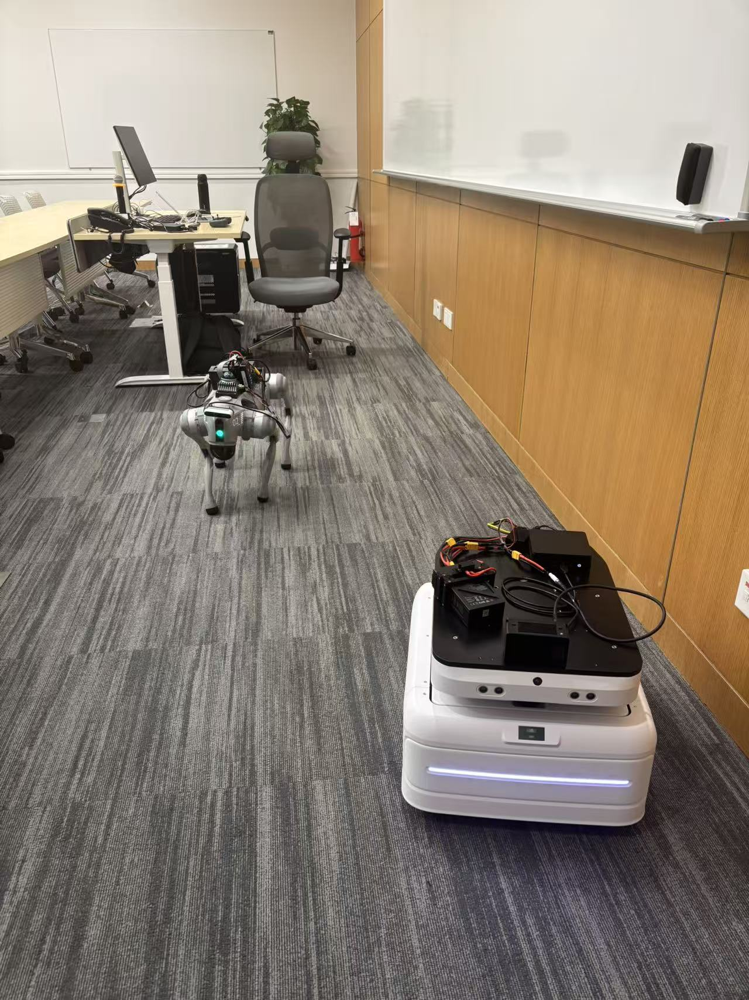
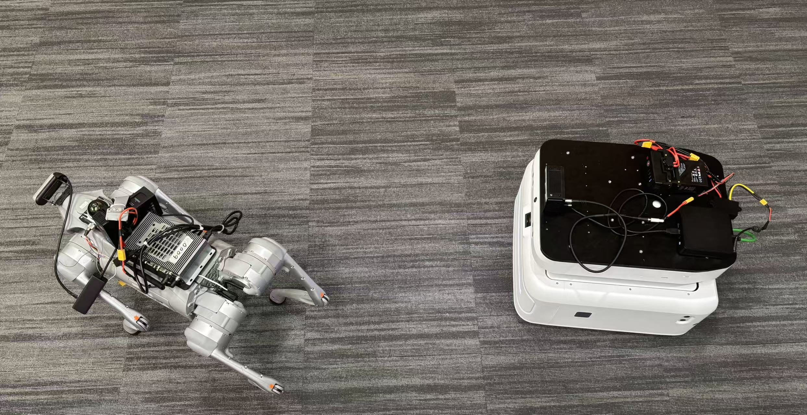
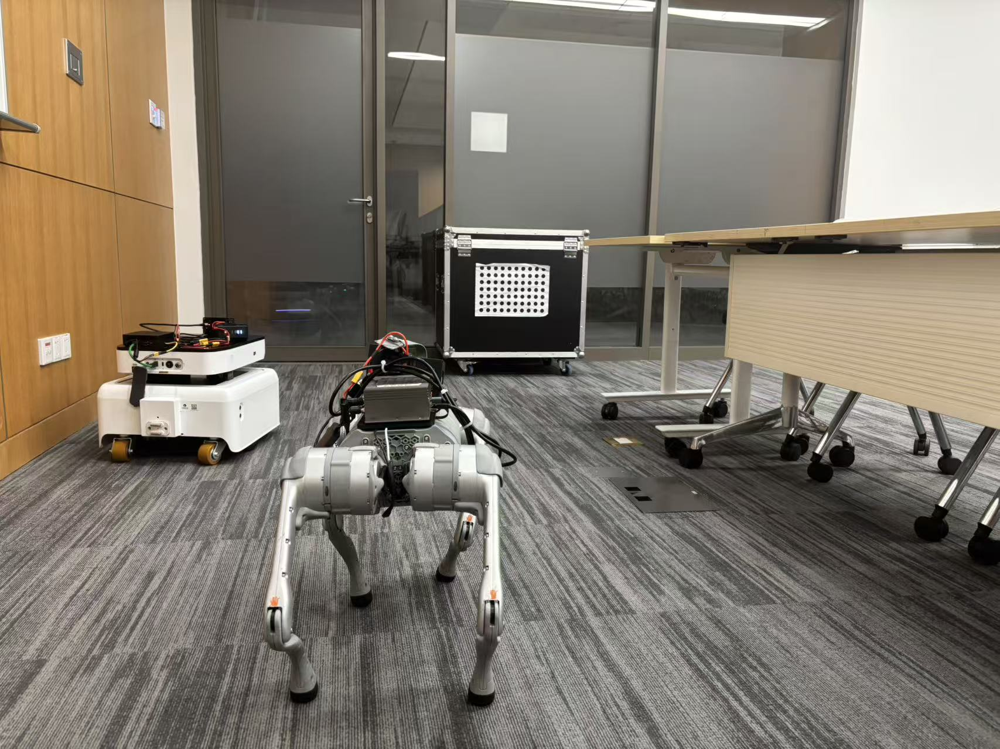
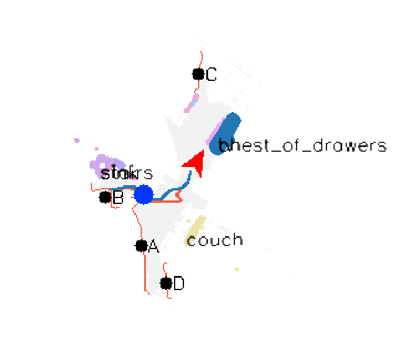
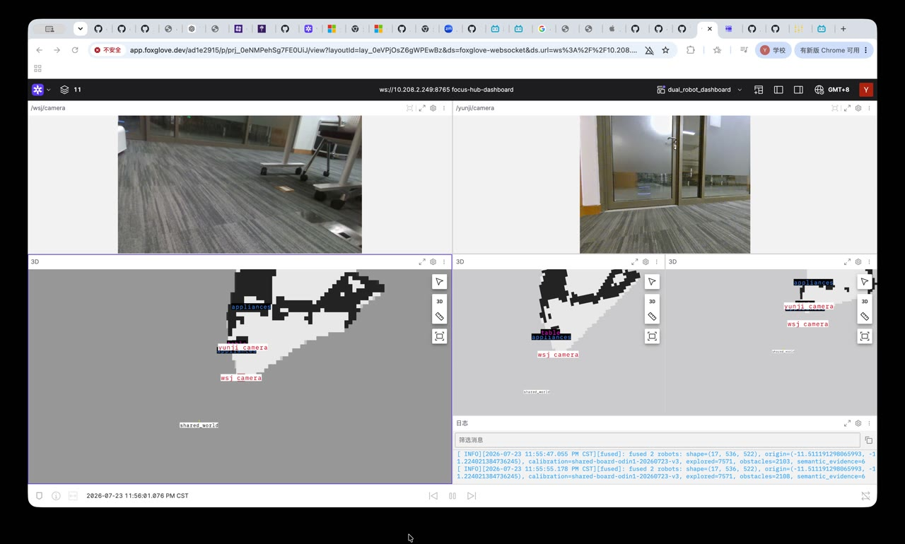

# TopoFocus Realworld

TopoFocus 的真机仓库：一台 GPU Hub 接收机器人观测、构建/融合语义地图并发布可过期的高层决策；Go2 端保留最终停止与拒绝权限。本仓库同时保存审计过的研究源码快照、Hub 实现和 WSJ Jetson 的可复现部署层。

目标仓库：`git@github.com:AlanZhu2006/topofocus_realworld.git`

## 当前结论（2026-07-24）

权威状态见 [CURRENT_STATUS.md](CURRENT_STATUS.md)。摘要如下：

- 双机真实链路已经到达“观测、在线地图、VLM、高层 v2 目标、TinyNav/WATER、本地反馈、租约续期和故障 HOLD”，但还没有一次可计入 SR/SPL 的正式场景成功。
- WSJ 当前为 D435i + 修复后的 TinyNav perception/IMU + 在线
  BuildMap；Yunji 当前为 Odin1 `O1-P070100205`，不是旧的 RealSense
  路径。
- 最后一次 predecessor 共享标定是
  `shared-board-odin1-20260723-v3`；它保留为历史证据，但不会被自动提升为
  新 `current`。断电本身不等于机械位姿变化；下一次现场仍需先用新的
  一键入口完成定量移动板留出并生成 persistent session。
- `official-run01-retry3` 连续接受了九个 v2 batch，证明实际 v2
  heartbeat-authority 修复生效；Yunji 原地判定到达，WSJ 只收到
  `vx=0.000, wz=-0.200`，现场未见运动，随后本地
  `ODOMETRY_STALE` fail-closed。该尝试不计入指标。
- retry3 后的 WSJ 有效速度下限和 odometry/occupancy 独立回调修复已
  通过本机测试并以相同哈希同步到两台机器人磁盘，但尚未重启加载和
  真机验证。
- Hub 默认及当前均为 `GOAL=false`。Hub 只发布版本化、可过期的高层
  目标；机器人端保留最终停止和拒绝权限。
- 语义图使用真实模型推理和像素 mask，但 chair/plant 等投影仍是
  `model_inference_map_projected_unverified`，不能当作真实标签。
- 四场景 × 五次、标准 SPL/源码兼容 SPL 和 episode 报告已经实现；
  当前没有有效正式样本，因此 SR/SPL 暂无数值。
- 新的一键链路会持久化 Git、标定、transform、地图序号边界和远端部署
  身份；正常调试/实验不再手工替换 v12 路径。实现提交
  `90dd8fe43dad16515017fe4fd9bd017e02277bf6` 已通过本机回归测试，并以
  相同归档和 175 条逐文件哈希同步到两台机器人磁盘，但机器人进程没有
  重启加载；还需要一次新的真机标定来生成 `current` 会话。

## 实机直接入口

根目录的 [`command.txt`](command.txt) 是可直接运行的 Bash 入口。新摆位
第一次运行：

```bash
bash command.txt
```

它依次执行共享标定、fresh map、Foxglove、严格无运动 debug，并在全部
通过后再次要求现场确认，才会进入一次正式运动。后续复用 `current`
session 时可直接运行：

```bash
bash command.txt debug
bash command.txt live scene01-chair scene01-chair-run01 chair
```

每次 live 都必须在终端重新输入现场确认词；确认不会保存到 session，也
不会因为执行了 `command.txt` 而自动跳过。

## 真机实验平台

| 实验室场景 | 双机俯视 |
| --- | --- |
|  |  |

实验系统由两台异构机器人组成：

- **WSJ**：Unitree Go2，使用 D435i、TinyNav perception、在线
  BuildMap、TinyNav 局部规划与受保护的 Go2 速度桥；
- **Yunji**：轮式移动平台，使用 Odin1 RGB/SLAM cloud/odometry 与
  WATER 高层导航接口；
- **GPU Hub**：集中构建/融合双机语义地图，运行 YOLO 与
  Perception/Judgment/Decision VLM，并只向机器人发布可过期的高层目标。

### 双机共享坐标系标定



两台相机同时观测同一块 7 × 10 对称圆点板。每个新物理摆位采集一组拟合
观测和一组独立移动后的留出观测，用于求解并验证 gravity-preserving
共享坐标变换；机器人在标定阶段没有运动命令路径。

### 语义 2D 地图展示目标



这张图是用户提供的可视化目标参考：最终 Foxglove 2D 图应同时清晰呈现
机器人位姿、轨迹、可通行/障碍区域、像素级语义色块和类别标签。它不是
当前算法准确率或成功场景截图。

后续会把已经运行过的失败 demo 视频一并上传到
[`media/demo/`](media/demo/README.md)，并注明对应 episode、观察到的失败
原因和是否计入指标。失败 demo 会作为可复现排障材料保留，不计入 SR/SPL
成功样本。

首个公开片段记录了早期 Foxglove 双机 dashboard 中相机画面正常、但 2D
占据/语义地图呈现射线状和不规则区域的问题：

[](media/demo/dashboard_failure_20260724.mp4)

[播放 24 秒 MP4](media/demo/dashboard_failure_20260724.mp4)。该片段是失败
现象展示，不对应可计入指标的正式 episode；地图原因与后续修复证据见
[实时地图恢复审计](audit/LIVE_MAP_RECOVERY_20260722.md)。

## 从干净克隆开始

```bash
git clone git@github.com:AlanZhu2006/topofocus_realworld.git
cd topofocus_realworld

# 只安装轻量 Hub/测试依赖，不下载模型或仿真数据。
bash hub/scripts/bootstrap_dev.sh
bash hub/scripts/verify_repository.sh --tests
```

完整 GPU 推理还需要仓库外的 RedNet、YOLO、CLIP 和 GLM 权重。它们的固定路径、大小和 SHA-256 见 `manifests/artifacts.json`；Git 不保存模型、录包、地图、token 或虚拟环境。

## 在另一台 Go2 Jetson 上复现

以下步骤只构造源码和检查环境，不会移动机器人：

```bash
git clone https://github.com/AlanZhu2006/topofocus_realworld.git
cd topofocus_realworld

# 从固定 TinyNav 上游 commit 重建 WSJ 已验证源码状态。
bash hub/robot_overlay/bootstrap_go2.sh \
  --destination /home/nvidia/twork/tinynav-topofocus

# 先查看，再显式安装 USB 稳定性配置。
bash hub/robot_overlay/install_go2_host_config.sh
sudo bash hub/robot_overlay/install_go2_host_config.sh --apply

# 只读检查；--hardware 要求 D435i 已连接且 power/control=on。
bash hub/robot_overlay/verify_go2.sh --hardware --tests
```

环境检查全部通过、操作者在现场后，才可启动“相机 + perception”观测栈：

```bash
cp hub/robot_overlay/config/go2.env.example hub/robot_overlay/go2.env
bash hub/robot_overlay/start_go2_observation.sh \
  --env hub/robot_overlay/go2.env
```

这个入口明确不启动 planner、`cmd_vel`、Unitree bridge 或 Hub GOAL receiver。原生 BuildMap 的人工移动与安全保存步骤见 [复现手册](docs/REPRODUCE.md)。

## 仓库边界

| 路径 | 作用 | Git 策略 |
| --- | --- | --- |
| `source/Focus_realworld/` | 原始集中式 Habitat/TopoFocus 研究代码 | 只读快照，逐文件校验 |
| `dependencies/` | RedNet 与修改版 Habitat 参考源码 | 只读快照，逐文件校验 |
| `hub/` | 真机协议、Hub、工具、测试和机器人部署层 | 主开发区 |
| `hub/robot_overlay/tinynav_snapshot/` | WSJ 所用 TinyNav 固定基线补丁与实验快照 | 可审计、可重建 |
| `audit/` | 已观察结果与门禁证据 | 入库 |
| `media/` | 真机设备展示、标定照片与公开 demo 索引 | 入库；每个素材记录来源/哈希 |
| `manifests/` | 来源、环境、外部资产和 SHA-256 | 入库 |
| `artifacts/`, `data/`, `logs/`, `hub/runtime/` | 权重、录包、地图、日志、token、运行状态 | 永不入库 |

不要在 `source/` 或 `dependencies/` 中开发部署代码；新真机代码只进入 `hub/`。

## 文档入口

- [当前权威状态、已验证边界和下一步](CURRENT_STATUS.md)
- [历史审计索引](audit/README.md)
- [从零复现本机与新 Go2](docs/REPRODUCE.md)
- [WSJ 已观察基线与遗留问题](docs/WSJ_BASELINE_20260721.md)
- [Git 分支、发布与快照更新规则](docs/GIT_WORKFLOW.md)
- [系统架构](ARCHITECTURE.md)
- [操作与验证门禁](RUNBOOK.md)
- [持久标定、无运动调试与正式实验一键流程](hub/docs/ONECLICK_SESSION_WORKFLOW.md)
- [传输协议](hub/docs/TRANSPORT.md)
- [v2 双机真机最短上线清单](hub/docs/V2_PHYSICAL_QUICKSTART.md)
- [坐标系约束](hub/docs/COORDINATE_FRAMES.md)
- [实时地图与 Foxglove 契约](hub/docs/LIVE_MAPPING.md)
- [双机 VLM 影子调度实测](audit/LIVE_VLM_SHADOW_20260722.md)
- [HPC 源码派生连续 VLM 场景与边界](audit/SOURCE_DERIVED_VLM_SCENE_RUNNER_20260723.md)
- [WSJ 重启后明日就绪检查](audit/WSJ_POST_REBOOT_READINESS_20260722.md)
- [2026-07-23 真机 VLM 最短流程](hub/docs/VLM_LIVE_EXPERIMENT_20260723.md)
- [Yunji Odin1 替换部署、校验与重新标定](hub/docs/YUNJI_ODIN1_DEPLOYMENT.md)
- [离线地图诊断、移动验收和既有标定脚本复用](hub/docs/OFFLINE_MAP_VALIDATION.md)
- [来源与第三方说明](SOURCE_MANIFEST.md)

任何让机器人运动的工作都必须另行通过标定、replay、超时/断网、急停和 HIL 门禁；克隆或运行本仓库的默认脚本本身不构成运动授权。
