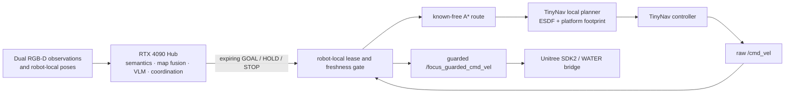

# TopoFocus Real-World

TopoFocus's real-world dual-robot system: a GPU hub handles online mapping,
semantic understanding, VLM decisions and high-level coordination, while
Robot 0 and Robot 1 handle planning, control and safety stops locally.

## Reference deployment

<p align="center">
  
</p>

| Role | Compute | Platform and sensing | Primary runtime |
| --- | --- | --- | --- |
| GPU Hub | Intel Core i9-14900K, 64 GB RAM, NVIDIA GeForce RTX 4090 | ASUS workstation, Ubuntu 22.04 | Semantic inference, shared-map fusion, VLM decisions and route coordination |
| Robot 0 · WSJ | NVIDIA Jetson Orin NX, JetPack 6.2.1 | Unitree Go2 + Intel RealSense D435i | TinyNav perception, online occupancy, planning/control and guarded Unitree SDK2 output |
| Robot 1 · Yunji | ASUS NUC 12 Pro NUC12WSK-B, Core i7-1260P, 16 GB RAM | Wheeled chassis + [Manifold Tech Odin1](https://www.manifoldtech.cn/) | Odin localization, TinyNav planning/control and guarded WATER output |

These are the observed reference machines. The Hub publishes only versioned,
expiring high-level targets; each robot retains final stop and target-rejection
authority.

## System architecture


```mermaid
flowchart LR
    O["Dual RGB-D observations<br/>and robot-local poses"] --> H
    H["RTX 4090 Hub<br/>semantics · map fusion · VLM · coordination"]
    H -->|"expiring GOAL / HOLD / STOP"| G
    G["robot-local lease and freshness gate"] --> A
    A["known-free A* route"] --> T
    T["TinyNav local planner<br/>ESDF + platform footprint"] --> C
    C["TinyNav controller"] --> V["raw /cmd_vel"]
    V --> G
    G --> Q["guarded /focus_guarded_cmd_vel"]
    Q --> B["Unitree SDK2 / WATER bridge"]
```

## Real-world deployment

The physical system follows the main method's two-agent navigation pipeline:
shared semantic mapping, source-compatible frontier and history candidates,
and the Perception–Judgment–Decision VLM cascade over one consistent A–D
candidate set. The GPU hub runs RedNet MP3D-40 together with the
source-referenced Detectron2 Mask R-CNN semantic composition, fuses the
robots' obstacle, explored and semantic layers, and coordinates
non-conflicting high-level targets.

| Main-method component | Physical deployment |
| --- | --- |
| RGB-D observation and agent pose | D435i/Odin1 RGB-D with each robot's local SLAM |
| RedNet + Mask R-CNN semantics | Source-compatible semantic inference on the GPU hub |
| Shared frontier/history exploration | Fused dual-robot map with stable A–D candidates |
| Perception–Judgment–Decision policy | CogVLM2-based shared decision cascade |
| Simulator navigation actions | Robot-local planning and control from expiring high-level targets |

The local planner on each platform retains final collision, stop and target
rejection authority throughout execution.

### Robot-local planning and control

Each high-level target is first routed on the latest known-free occupancy grid
with bounded 8-connected A*: unknown/occupied cells are blocked, diagonal
corner cutting is forbidden, and frontier targets may advance safely to the
known-map edge. A rolling waypoint is then evaluated by TinyNav's local
trajectory lattice and ESDF footprint scorer. Forward arcs, in-place yaw and
collision-scored short stopped prefixes are available; reverse candidates are
excluded, and an all-collision result is a stop.

TinyNav's path follower uses the measured base-to-camera transform and
rotate-first handling. Raw velocity never reaches a chassis directly: the v2
robot receiver checks target lease, calibration, odometry, occupancy,
trajectory freshness, reachability and controller pause acknowledgement before
publishing guarded velocity. The Go2 and WATER bridges add independent stale
command watchdogs.

### Reproducible WSJ baseline

The WSJ reference path is explicitly packaged for an RTX 4090 Hub + Unitree
Go2 + Jetson Orin NX:

```bash
bash hub/scripts/bootstrap_dev.sh
python3 hub/tools/verify_public_baseline.py --workspace .
bash hub/robot_overlay/bootstrap_go2.sh \
  --destination /tmp/tinynav-topofocus
```

The last command reconstructs the pinned TinyNav/Go2 source tree and does not
start ROS or connect to a robot. Hardware setup, software versions,
planner/controller parameters, expected Git objects and staged acceptance
tests are in the
[WSJ reproducible deployment baseline](docs/WSJ_REPRODUCIBLE_BASELINE.md).
The exact machine-readable contract is
[`realworld_dual_robot_v1.json`](hub/config/deployments/realworld_dual_robot_v1.json).

## Cross-robot calibration

<p align="center">
  
</p>

With both robots stationary, each robot's own camera captures one shared
7×10 symmetric circle-grid board (40 mm spacing) and solves its pose by
PnP; the two per-camera poses compose into a fixed transform between the
robots' camera frames, registering their local odometry into one shared
frame. The board is then moved by at least 10 cm or rotated by at least 5°
and re-observed as an independent holdout — the calibration is accepted
only if it also explains this second, independently moved observation.

## Evaluation settings

| Scene | Target | Navigation setting |
| --- | --- | --- |
| Scene 01 | Chair | Short-range navigation |
| Scene 02 | Plant | Medium-range navigation |
| Scene 03 | Plant | Long-range cooperative exploration |

## Scene 01 · Short-range Chair

The short-range setting starts both robots from the same lab area and targets
a nearby white chair. All five formal experiments succeeded.

| Trials | Success | SR | Mean source-compatible SPL | Mean Standard SPL |
| ---: | ---: | ---: | ---: | ---: |
| `5` | `5` | `1.0` | `0.726088` | `0.780993` |

Standard SPL uses the independently measured shortest feasible path
`L≈3.25 m`; source-compatible SPL uses the arriving robot's start-to-arrival
displacement `D` as a source-compatible reference.

### Explored semantic map

<p align="center">
  
</p>

### Real-robot rollouts

<table>
  <tr>
    <td width="50%" align="center">
      <strong>Formal 01 · SUCCESS</strong><br>
      <small>Third view</small><br>
      <br>
      <small>Dashboard</small><br>
      <br>
      Robot 0 explores a frontier first, then switches to the chair semantic
      region and auto-ARRIVED; Robot 1 advances along an independent
      frontier and HOLDs in sync.<br>
      <a href="media/demo/scene01_formal_01_third_view.mp4">Third view</a> ·
      <a href="media/demo/scene01_formal_01_dashboard.mp4">Dashboard</a>
    </td>
    <td width="50%" align="center">
      <strong>Formal 02 · SUCCESS</strong><br>
      <small>Third view</small><br>
      <br>
      <small>Dashboard</small><br>
      <br>
      Robot 0 finishes frontier exploration and enters the chair semantic
      region, auto-ARRIVED; Robot 1 is held near-stationary by the
      coordinator.<br>
      <a href="media/demo/scene01_formal_02_third_view.mp4">Third view</a> ·
      <a href="media/demo/scene01_formal_02_dashboard.mp4">Dashboard</a>
    </td>
  </tr>
  <tr>
    <td width="50%" align="center">
      <strong>Formal 03 · SUCCESS</strong><br>
      <small>Third view</small><br>
      <br>
      <small>Dashboard</small><br>
      <br>
      Robot 0 completes an initial round of frontier exploration; Robot 1
      relays exploration and enters the chair's 0.5 m success region,
      confirmed on arrival by the operator.<br>
      <a href="media/demo/scene01_formal_03_third_view.mp4">Third view</a> ·
      <a href="media/demo/scene01_formal_03_dashboard.mp4">Dashboard</a>
    </td>
    <td width="50%" align="center">
      <strong>Formal 04 · SUCCESS</strong><br>
      <small>Third view</small><br>
      <br>
      <small>Dashboard</small><br>
      <br>
      Both robots explore in alternating parallel rounds; Robot 1 switches
      to the chair semantic region and auto-ARRIVED, while Robot 0 finishes
      its independent frontier and HOLDs in sync.<br>
      <a href="media/demo/scene01_formal_04_third_view.mp4">Third view</a> ·
      <a href="media/demo/scene01_formal_04_dashboard.mp4">Dashboard</a>
    </td>
  </tr>
  <tr>
    <td colspan="2" align="center">
      <strong>Formal 05 · SUCCESS</strong><br>
      <small>Third view</small><br>
      <br>
      <small>Dashboard</small><br>
      <br>
      Robot 0 finishes frontier exploration and continuously navigates to
      the chair, auto-ARRIVED; Robot 1 HOLDs under route coordination.<br>
      <a href="media/demo/scene01_formal_05_third_view.mp4">Third view</a> ·
      <a href="media/demo/scene01_formal_05_dashboard.mp4">Dashboard</a>
    </td>
  </tr>
</table>

### Per-run metrics

| Run | Arriving robot | Actual path `P` | Source-compatible SPL | Standard SPL |
| --- | --- | ---: | ---: | ---: |
| Formal 01 | Robot 0 | `3.850792 m` | `0.628399` | `0.843982` |
| Formal 02 | Robot 0 | `2.760377 m` | `0.892911` | `1.000000` |
| Formal 03 | Robot 1 | `4.048842 m` | `0.864048` | `0.802699` |
| Formal 04 | Robot 1 | `3.210222 m` | `0.956361` | `1.000000` |
| Formal 05 | Robot 0 | `12.582981 m` | `0.288722` | `0.258285` |

[Full five-experiment archive](audit/SCENE01_CHAIR_FORMAL_EXPERIMENTS_01_05_20260725.md)
· [Machine-readable results](manifests/scene01_chair_formal_experiments_20260725.json)
· [Media manifest](media/README.md)
· [Run instructions](hub/docs/ONECLICK_SESSION_WORKFLOW.md)

## Scene 02 · Medium-range Plant

The medium-range setting requires both robots to explore cooperatively toward
a more distant plant target.

| Trials | Success | SR | Mean source-compatible SPL | Mean Standard SPL |
| ---: | ---: | ---: | ---: | ---: |
| `5` | `3` | `0.600000` | `0.557367` | `0.531689` |

Both means count the two failures at zero contribution. Standard SPL uses
the operator-provided independently measured shortest feasible path
`L≈7 m` (Scene 01's `3.25 m` is not reused).

### Explored semantic map

<p align="center">
  
</p>

<table>
  <tr>
    <td width="50%" align="center">
      <strong>Formal 01 · FAILURE</strong><br>
      <small>Third view</small><br>
      <br>
      <small>Dashboard</small><br>
      <br>
      Formal 01 failed during coordinated execution: one assigned frontier
      was rejected as locally unreachable, and the remaining
      semantic-navigation leg terminated before arrival.<br>
      <a href="media/demo/scene02_formal_01_third_view.mp4">Third view</a> ·
      <a href="media/demo/scene02_formal_01_dashboard.mp4">Dashboard</a>
    </td>
    <td width="50%" align="center">
      <strong>Formal 02 · FAILURE</strong><br>
      <small>Third view</small><br>
      <br>
      <small>Dashboard</small><br>
      <br>
      Robot 1 explores 13 rounds without ever finding the plant semantic
      region — one frontier branch was observed heading away from the
      target — while Robot 0 HOLDs under route coordination throughout.
      The run is stopped by a two-interval no-progress guard after
      displacement stalled below 0.05 m.<br>
      <a href="media/demo/scene02_formal_02_third_view.mp4">Third view</a> ·
      <a href="media/demo/scene02_formal_02_dashboard.mp4">Dashboard</a>
    </td>
  </tr>
  <tr>
    <td width="50%" align="center">
      <strong>Formal 03 · SUCCESS</strong><br>
      <small>Third view</small><br>
      <br>
      <small>Dashboard</small><br>
      <br>
      Robot 1 explores frontiers, switches to the plant semantic region and
      auto-ARRIVED, confirmed by the operator; Robot 0 remains in HOLD
      throughout.<br>
      <a href="media/demo/scene02_formal_03_third_view.mp4">Third view</a> ·
      <a href="media/demo/scene02_formal_03_dashboard.mp4">Dashboard</a>
    </td>
    <td width="50%" align="center">
      <strong>Formal 04 · SUCCESS</strong><br>
      <small>Third view</small><br>
      <br>
      <small>Dashboard</small><br>
      <br>
      Route coordination keeps Robot 0 in HOLD while Robot 1 follows the
      plant semantic route and auto-ARRIVED, confirmed by the operator.<br>
      <a href="media/demo/scene02_formal_04_third_view.mp4">Third view</a> ·
      <a href="media/demo/scene02_formal_04_dashboard.mp4">Dashboard</a>
    </td>
  </tr>
  <tr>
    <td colspan="2" align="center">
      <strong>Formal 05 · SUCCESS</strong><br>
      <small>Third view</small><br>
      <br>
      <small>Dashboard</small><br>
      <br>
      Both robots advance concurrently where their route corridors are
      clear; Robot 1 completes the plant semantic route and auto-ARRIVED,
      confirmed by the operator.<br>
      <a href="media/demo/scene02_formal_05_third_view.mp4">Third view</a> ·
      <a href="media/demo/scene02_formal_05_dashboard.mp4">Dashboard</a>
    </td>
  </tr>
</table>

### Per-run metrics

| Run | Result | Robot 0 path | Robot 1 path | Source-compatible SPL | Standard SPL |
| --- | --- | ---: | ---: | ---: | ---: |
| Formal 01 | FAILURE | `6.104564 m` | `1.905387 m` | `0.0` | `0.0` |
| Formal 02 | FAILURE | `1.034858 m` | `7.425951 m` | `0.0` | `0.0` |
| Formal 03 | SUCCESS | `0.728655 m` | `8.356524 m` | `0.865192` | `0.837669` |
| Formal 04 | SUCCESS | `0.454227 m` | `7.579081 m` | `0.961379` | `0.923595` |
| Formal 05 | SUCCESS | `2.032182 m` | `7.802197 m` | `0.960264` | `0.897183` |

[Formal 01 failure record](audit/SCENE02_PLANT_FORMAL_EXPERIMENT_01_FAILURE_20260728.md)
· [Formal 02 failure record](audit/SCENE02_PLANT_FORMAL_EXPERIMENT_02_FAILURE_20260728.md)
· [Formal 03 success record](audit/SCENE02_PLANT_FORMAL_EXPERIMENT_03_SUCCESS_20260728.md)
· [Formal 04 record](manifests/scene02_plant_formal_experiment_04_success_20260728.json)
· [Formal 05 record](manifests/scene02_plant_formal_experiment_05_success_20260728.json)
· [Machine-readable results](manifests/scene02_plant_formal_experiments_20260728.json)

## Scene 03 · Long-range Cooperative Plant

The long-range setting retains the plant target while increasing travel
distance and requiring both robots to explore and coordinate across the route.
