# TopoFocus Real-World

TopoFocus's real-world dual-robot system: a GPU hub handles online mapping,
semantic understanding, VLM decisions and high-level coordination, while
Robot 0 and Robot 1 handle planning, control and safety stops locally.

## Reference deployment

<p align="center">
  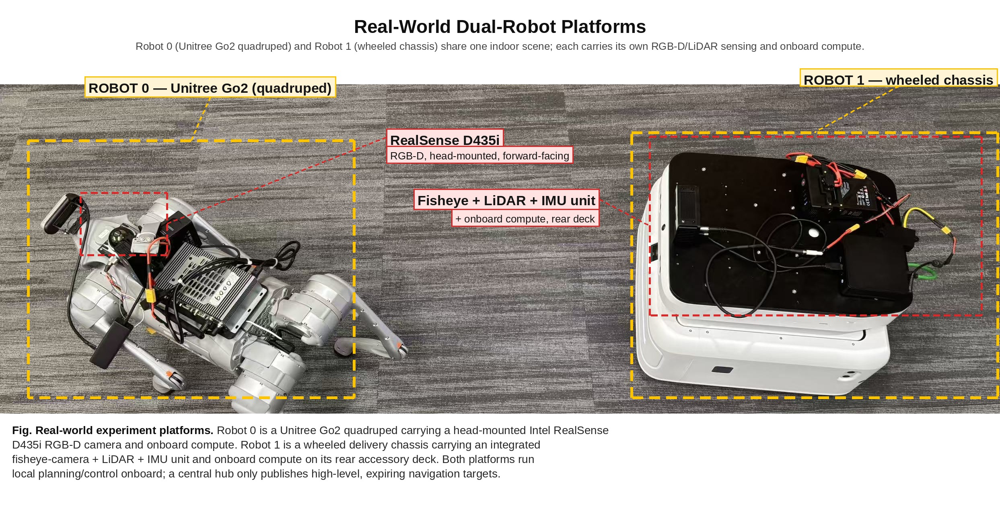
</p>

| Role | Compute | Platform and sensing | Primary runtime |
| --- | --- | --- | --- |
| GPU Hub | Intel Core i9-14900K, 64 GB RAM, NVIDIA GeForce RTX 4090 | ASUS workstation, Ubuntu 22.04 | Semantic inference, shared-map fusion, VLM decisions and route coordination |
| Robot 0 | NVIDIA Jetson Orin NX, JetPack 6.2.1 | Unitree Go2 + Intel RealSense D435i | TinyNav perception, online occupancy, planning/control and guarded Unitree SDK2 output |
| Robot 1 | ASUS NUC 12 Pro NUC12WSK-B, Core i7-1260P, 16 GB RAM | Wheeled chassis + [Manifold Tech Odin1](https://www.manifoldtech.cn/) | Odin localization, TinyNav planning/control and guarded WATER output |

These are the observed reference machines. The Hub publishes only versioned,
expiring high-level targets; each robot retains final stop and target-rejection
authority.

## System architecture

<p align="center">
  <a href="media/image/system_architecture.png">
    
  </a>
</p>

## Real-world deployment

The physical system follows the main method's two-agent navigation pipeline:
shared semantic mapping, source-compatible frontier and history candidates,
and a Perception–Judgment–Decision VLM cascade over one shared A–D candidate
set. The Hub runs RedNet and Detectron2 semantics, map fusion, VLM decisions
and route coordination.

Each robot routes an expiring target with bounded known-free A*, then uses
TinyNav's ESDF-scored local planner and path follower. Lease, calibration,
reachability and data-freshness checks gate raw `/cmd_vel` before an
independent Unitree SDK2 or WATER watchdog. Any invalid or all-collision state
stops locally.

### Clean-room deployment

The Hub and Go2 Jetson use different operating systems and architectures, so
deployment is one reviewed command per host rather than one command that
silently changes every machine. Clone the same Git revision on both hosts:

```bash
git clone https://github.com/AlanZhu2006/topofocus_realworld.git
cd topofocus_realworld
git rev-parse HEAD
```

First run the repository-only gate. It checks the deployment contract and
file hashes; it does not install software or connect to a robot:

```bash
python3 hub/tools/verify_public_baseline.py --workspace .
```

On the Ubuntu 22.04 RTX 4090 Hub, the first command prints the complete plan
and the second creates the locked Python/CUDA environment, obtains the pinned
real-world models after license acknowledgement, builds Detectron2 and runs
the Hub tests:

```bash
bash hub/scripts/bootstrap_gpu_hub_cleanroom.sh
bash hub/scripts/bootstrap_gpu_hub_cleanroom.sh \
  --apply \
  --fetch-models \
  --accept-model-licenses
```

On Robot 0, first flash the recorded JetPack 6.2.1/L4T 36.4.7 image. From the
same repository revision on the Jetson Orin NX, review and apply the software
and dedicated Go2 Ethernet plans:

```bash
bash hub/robot_overlay/bootstrap_robot0_cleanroom.sh
bash hub/robot_overlay/bootstrap_robot0_cleanroom.sh --apply

bash hub/robot_overlay/configure_go2_network.sh
bash hub/robot_overlay/configure_go2_network.sh --apply
```

Then run the no-motion hardware gate:

```bash
config_root="${XDG_CONFIG_HOME:-$HOME/.config}/topofocus"
set -a
source "$config_root/robot-0.env"
set +a
source "$TINYNAV_SETUP"
"$TINYNAV_PYTHON" hub/robot_overlay/verify_robot0_cleanroom.py \
  --level hardware
```

The installers do not start ROS, planning, DDS actuation or robot motion.
Provision the runtime token separately as a mode-600 file, then create a fresh
cross-robot calibration/session and obtain explicit per-run motion
authorization through the linked operator workflow.

[Clean-room RTX 4090 + Unitree Go2 deployment](docs/ROBOT0_REPRODUCIBLE_BASELINE.md) ·
[Calibration and supervised-run workflow](hub/docs/ONECLICK_SESSION_WORKFLOW.md) ·
[Reproduction levels](docs/REPRODUCE.md) ·
[Machine-readable deployment contract](hub/config/deployments/realworld_dual_robot_v1.json)

## Cross-robot calibration

<p align="center">
  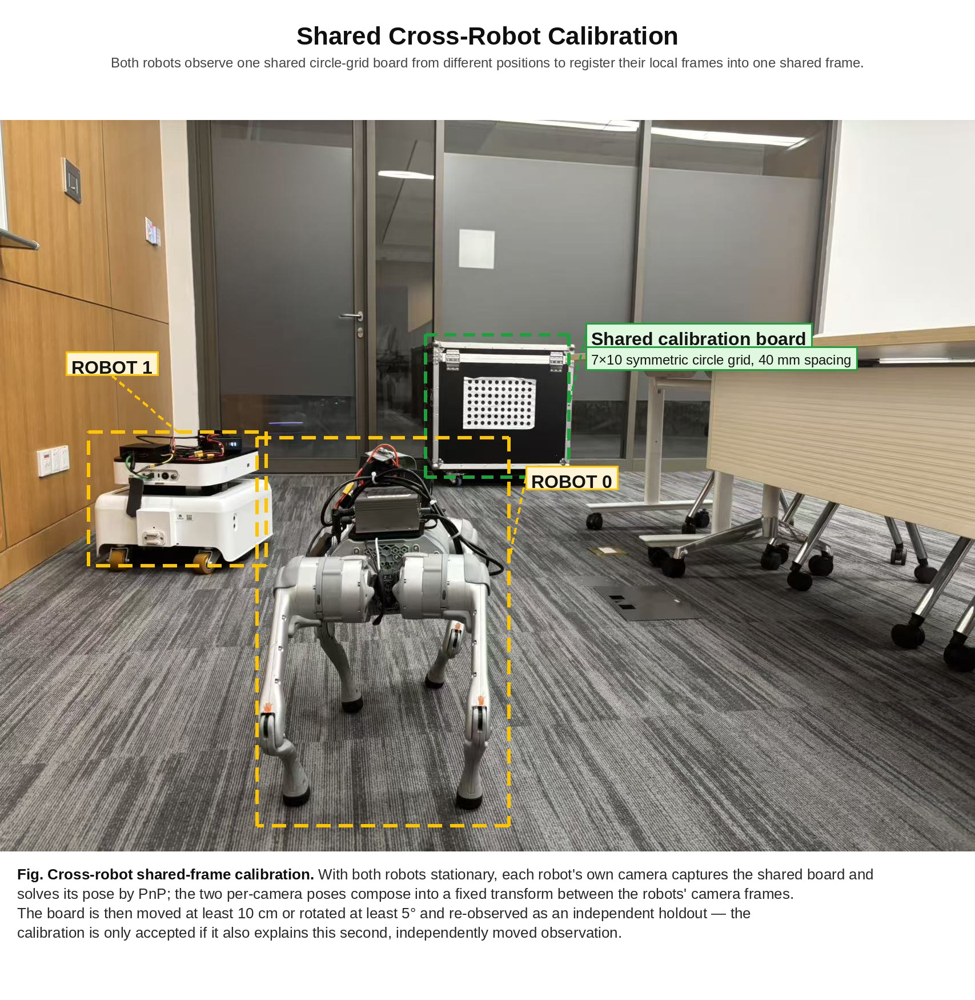
</p>

With both robots stationary, each robot's own camera captures one shared
7×10 symmetric circle-grid board (40 mm spacing) and solves its pose by
PnP; the two per-camera poses compose into a fixed transform between the
robots' camera frames, registering their local odometry into one shared
frame. The board is then moved by at least 10 cm or rotated by at least 5°
and re-observed as an independent holdout — the calibration is accepted
only if it also explains this second, independently moved observation.

## Evaluation settings

| Scene | Target | Navigation setting |
| --- | --- | --- |
| Scene 01 | Chair | Short-range navigation |
| Scene 02 | Plant | Medium-range navigation |
| Scene 03 | Plant | Long-range cooperative exploration |
| Scene 04 | Plant | Cooperative exploration |

## Scene 01 · Short-range Chair

The short-range setting starts both robots from the same lab area and targets
a nearby white chair. All five formal experiments succeeded.

| Trials | Success | SR | Mean source-compatible SPL | Mean Standard SPL |
| ---: | ---: | ---: | ---: | ---: |
| `5` | `5` | `1.0` | `0.726088` | `0.780993` |

Standard SPL uses the independently measured shortest feasible path
`L≈3.25 m`; source-compatible SPL uses the arriving robot's start-to-arrival
displacement `D` as a source-compatible reference.

### Explored semantic map

<p align="center">
  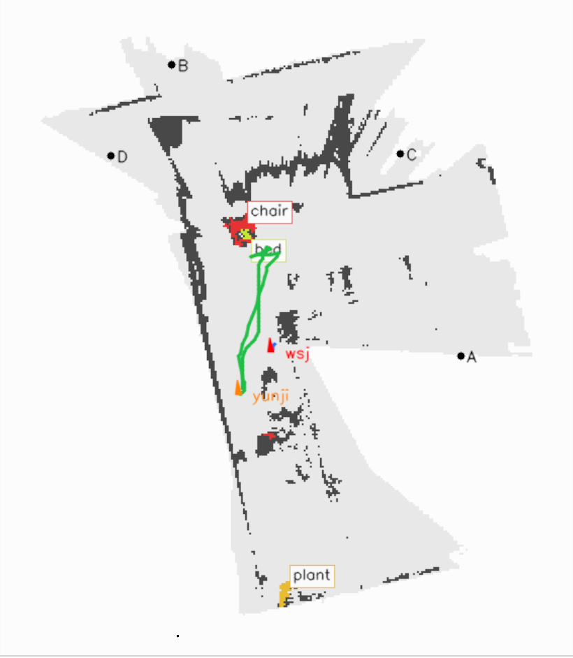
</p>

### Real-robot rollouts

<table>
  <tr>
    <td width="50%" align="center">
      <strong>Formal 01 · SUCCESS</strong><br>
      <small>Third view</small><br>
      <br>
      <small>Dashboard</small><br>
      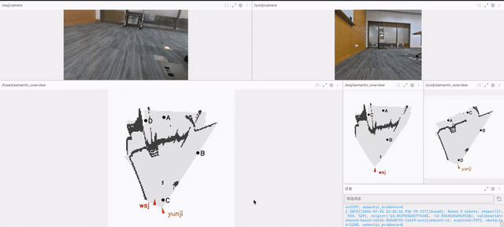<br>
      Robot 0 explores a frontier first, then switches to the chair semantic
      region and auto-ARRIVED; Robot 1 advances along an independent
      frontier and HOLDs in sync.<br>
      <a href="media/demo/scene01_formal_01_third_view.mp4">Third view</a> ·
      <a href="media/demo/scene01_formal_01_dashboard.mp4">Dashboard</a>
    </td>
    <td width="50%" align="center">
      <strong>Formal 02 · SUCCESS</strong><br>
      <small>Third view</small><br>
      <br>
      <small>Dashboard</small><br>
      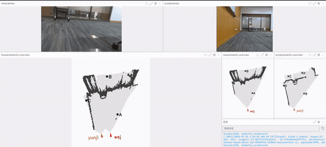<br>
      Robot 0 finishes frontier exploration and enters the chair semantic
      region, auto-ARRIVED; Robot 1 is held near-stationary by the
      coordinator.<br>
      <a href="media/demo/scene01_formal_02_third_view.mp4">Third view</a> ·
      <a href="media/demo/scene01_formal_02_dashboard.mp4">Dashboard</a>
    </td>
  </tr>
  <tr>
    <td width="50%" align="center">
      <strong>Formal 03 · SUCCESS</strong><br>
      <small>Third view</small><br>
      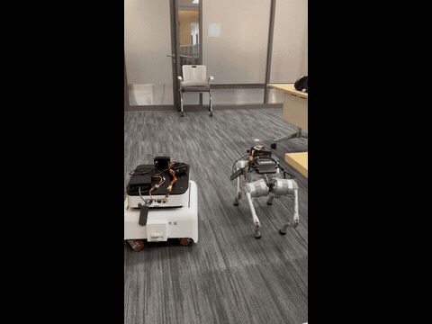<br>
      <small>Dashboard</small><br>
      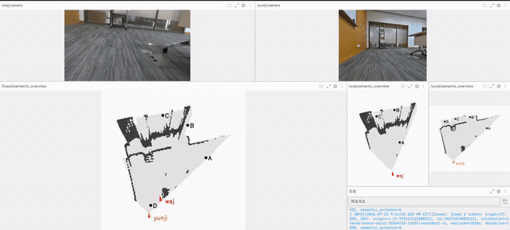<br>
      Robot 0 completes an initial round of frontier exploration; Robot 1
      relays exploration and enters the chair's 0.5 m success region,
      confirmed on arrival by the operator.<br>
      <a href="media/demo/scene01_formal_03_third_view.mp4">Third view</a> ·
      <a href="media/demo/scene01_formal_03_dashboard.mp4">Dashboard</a>
    </td>
    <td width="50%" align="center">
      <strong>Formal 04 · SUCCESS</strong><br>
      <small>Third view</small><br>
      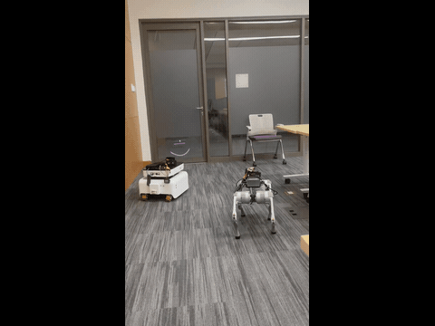<br>
      <small>Dashboard</small><br>
      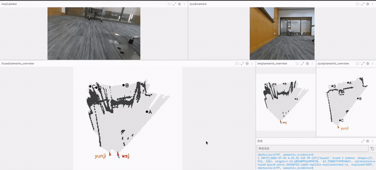<br>
      Both robots explore in alternating parallel rounds; Robot 1 switches
      to the chair semantic region and auto-ARRIVED, while Robot 0 finishes
      its independent frontier and HOLDs in sync.<br>
      <a href="media/demo/scene01_formal_04_third_view.mp4">Third view</a> ·
      <a href="media/demo/scene01_formal_04_dashboard.mp4">Dashboard</a>
    </td>
  </tr>
  <tr>
    <td colspan="2" align="center">
      <strong>Formal 05 · SUCCESS</strong><br>
      <small>Third view</small><br>
      <br>
      <small>Dashboard</small><br>
      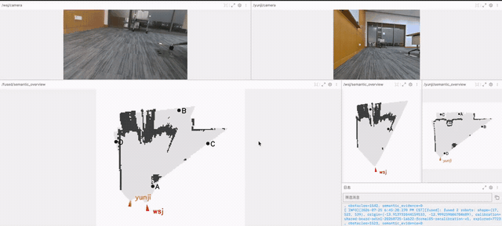<br>
      Robot 0 finishes frontier exploration and continuously navigates to
      the chair, auto-ARRIVED; Robot 1 HOLDs under route coordination.<br>
      <a href="media/demo/scene01_formal_05_third_view.mp4">Third view</a> ·
      <a href="media/demo/scene01_formal_05_dashboard.mp4">Dashboard</a>
    </td>
  </tr>
</table>

### Per-run metrics

| Run | Exploration rounds | Arriving robot | Actual path `P` | Source-compatible SPL | Standard SPL |
| --- | ---: | --- | ---: | ---: | ---: |
| Formal 01 | `2` | Robot 0 | `3.850792 m` | `0.628399` | `0.843982` |
| Formal 02 | `2` | Robot 0 | `2.760377 m` | `0.892911` | `1.000000` |
| Formal 03 | `3` | Robot 1 | `4.048842 m` | `0.864048` | `0.802699` |
| Formal 04 | `4` | Robot 1 | `3.210222 m` | `0.956361` | `1.000000` |
| Formal 05 | `2` | Robot 0 | `12.582981 m` | `0.288722` | `0.258285` |

[Full five-experiment archive](audit/SCENE01_CHAIR_FORMAL_EXPERIMENTS_01_05_20260725.md)
· [Machine-readable results](manifests/scene01_chair_formal_experiments_20260725.json)
· [Media manifest](media/README.md)
· [Run instructions](hub/docs/ONECLICK_SESSION_WORKFLOW.md)

## Scene 02 · Medium-range Plant

The medium-range setting requires both robots to explore cooperatively toward
a more distant plant target.

| Trials | Success | SR | Mean source-compatible SPL | Mean Standard SPL |
| ---: | ---: | ---: | ---: | ---: |
| `5` | `3` | `0.600000` | `0.557367` | `0.531689` |

Both means count the two failures at zero contribution. Standard SPL uses
the operator-provided independently measured shortest feasible path
`L≈7 m` (Scene 01's `3.25 m` is not reused).

### Explored semantic map

<p align="center">
  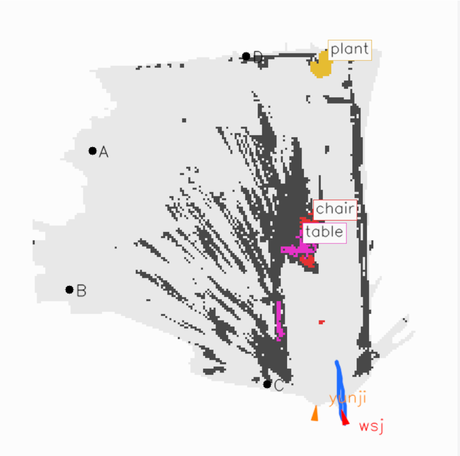
</p>

<table>
  <tr>
    <td width="50%" align="center">
      <strong>Formal 01 · FAILURE</strong><br>
      <small>Third view</small><br>
      <br>
      <small>Dashboard</small><br>
      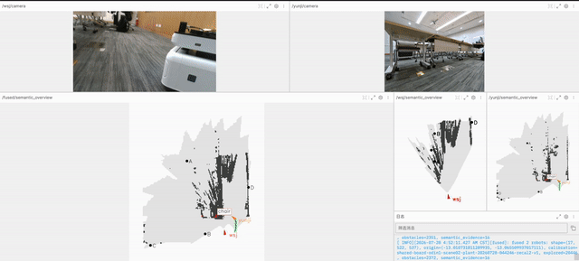<br>
      Formal 01 failed during coordinated execution: one assigned frontier
      was rejected as locally unreachable, and the remaining
      semantic-navigation leg terminated before arrival.<br>
      <a href="media/demo/scene02_formal_01_third_view.mp4">Third view</a> ·
      <a href="media/demo/scene02_formal_01_dashboard.mp4">Dashboard</a>
    </td>
    <td width="50%" align="center">
      <strong>Formal 02 · FAILURE</strong><br>
      <small>Third view</small><br>
      <br>
      <small>Dashboard</small><br>
      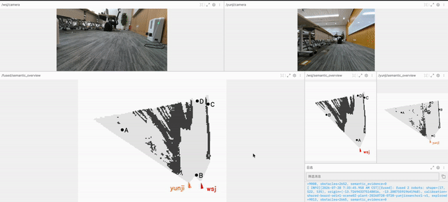<br>
      Robot 1 explores 13 rounds without ever finding the plant semantic
      region — one frontier branch was observed heading away from the
      target — while Robot 0 HOLDs under route coordination throughout.
      The run is stopped by a two-interval no-progress guard after
      displacement stalled below 0.05 m.<br>
      <a href="media/demo/scene02_formal_02_third_view.mp4">Third view</a> ·
      <a href="media/demo/scene02_formal_02_dashboard.mp4">Dashboard</a>
    </td>
  </tr>
  <tr>
    <td width="50%" align="center">
      <strong>Formal 03 · SUCCESS</strong><br>
      <small>Third view</small><br>
      <br>
      <small>Dashboard</small><br>
      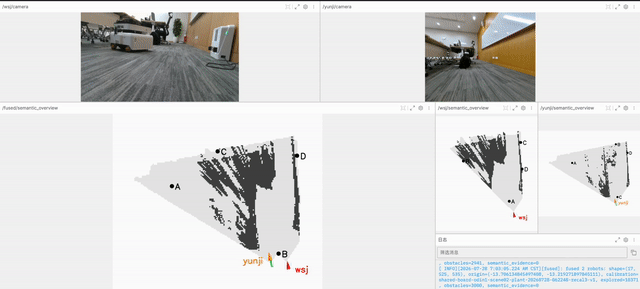<br>
      Robot 1 explores frontiers, switches to the plant semantic region and
      auto-ARRIVED, confirmed by the operator; Robot 0 remains in HOLD
      throughout.<br>
      <a href="media/demo/scene02_formal_03_third_view.mp4">Third view</a> ·
      <a href="media/demo/scene02_formal_03_dashboard.mp4">Dashboard</a>
    </td>
    <td width="50%" align="center">
      <strong>Formal 04 · SUCCESS</strong><br>
      <small>Third view</small><br>
      <br>
      <small>Dashboard</small><br>
      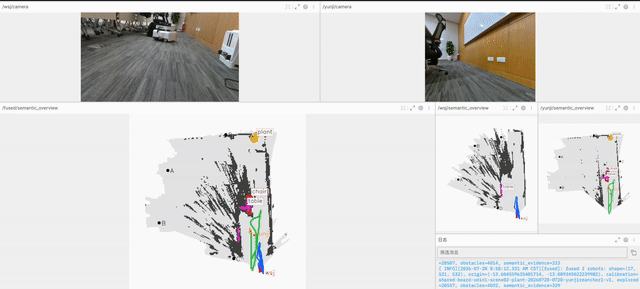<br>
      Route coordination keeps Robot 0 in HOLD while Robot 1 follows the
      plant semantic route and auto-ARRIVED, confirmed by the operator.<br>
      <a href="media/demo/scene02_formal_04_third_view.mp4">Third view</a> ·
      <a href="media/demo/scene02_formal_04_dashboard.mp4">Dashboard</a>
    </td>
  </tr>
  <tr>
    <td colspan="2" align="center">
      <strong>Formal 05 · SUCCESS</strong><br>
      <small>Third view</small><br>
      <br>
      <small>Dashboard</small><br>
      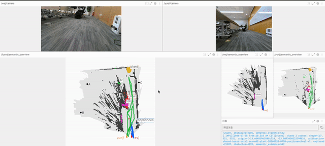<br>
      Both robots advance concurrently where their route corridors are
      clear; Robot 1 completes the plant semantic route and auto-ARRIVED,
      confirmed by the operator.<br>
      <a href="media/demo/scene02_formal_05_third_view.mp4">Third view</a> ·
      <a href="media/demo/scene02_formal_05_dashboard.mp4">Dashboard</a>
    </td>
  </tr>
</table>

### Per-run metrics

| Run | Result | Exploration rounds | Robot 0 path | Robot 1 path | Source-compatible SPL | Standard SPL |
| --- | --- | ---: | ---: | ---: | ---: | ---: |
| Formal 01 | FAILURE | `4` | `6.104564 m` | `1.905387 m` | `0.0` | `0.0` |
| Formal 02 | FAILURE | `13` | `1.034858 m` | `7.425951 m` | `0.0` | `0.0` |
| Formal 03 | SUCCESS | `11` | `0.728655 m` | `8.356524 m` | `0.865192` | `0.837669` |
| Formal 04 | SUCCESS | `4` | `0.454227 m` | `7.579081 m` | `0.961379` | `0.923595` |
| Formal 05 | SUCCESS | `5` | `2.032182 m` | `7.802197 m` | `0.960264` | `0.897183` |

[Formal 01 failure record](audit/SCENE02_PLANT_FORMAL_EXPERIMENT_01_FAILURE_20260728.md)
· [Formal 02 failure record](audit/SCENE02_PLANT_FORMAL_EXPERIMENT_02_FAILURE_20260728.md)
· [Formal 03 success record](audit/SCENE02_PLANT_FORMAL_EXPERIMENT_03_SUCCESS_20260728.md)
· [Formal 04 record](manifests/scene02_plant_formal_experiment_04_success_20260728.json)
· [Formal 05 record](manifests/scene02_plant_formal_experiment_05_success_20260728.json)
· [Machine-readable results](manifests/scene02_plant_formal_experiments_20260728.json)

## Scene 03 · Long-range Cooperative Plant

The long-range setting retains the plant target while increasing travel
distance and requiring both robots to explore and coordinate across the route.

| Trials | Success | SR | Mean source-compatible SPL | Mean Standard SPL |
| ---: | ---: | ---: | ---: | ---: |
| `5` | `3` | `0.600000` | `0.365962` | `0.546194` |

Both means count the two time-limit failures at zero contribution. Standard
SPL uses the independently measured approximate shortest feasible path
`L≈14 m`.

### Explored semantic map

<p align="center">
  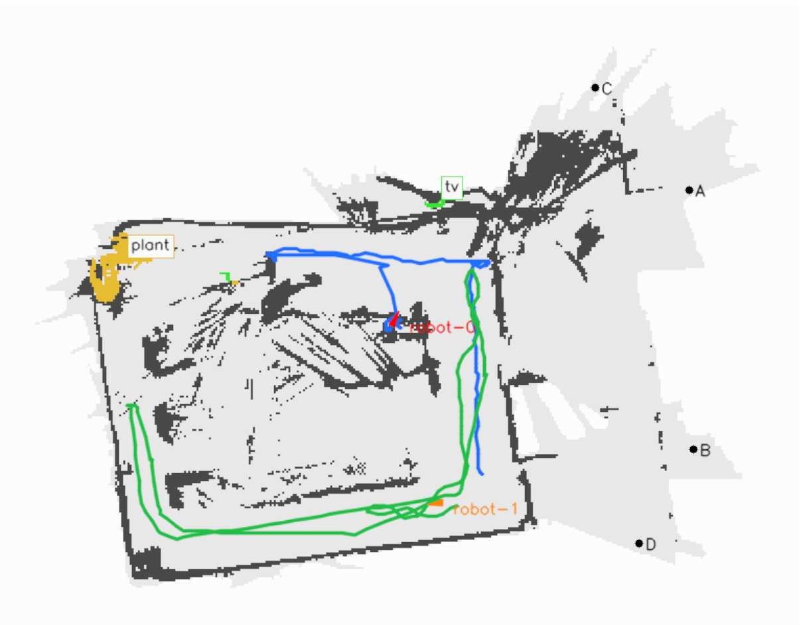
</p>

### Real-robot rollouts

<table>
  <tr>
    <td width="50%" align="center">
      <strong>Formal 01 · FAILURE</strong><br>
      <small>Third view</small><br>
      <br>
      <small>Dashboard</small><br>
      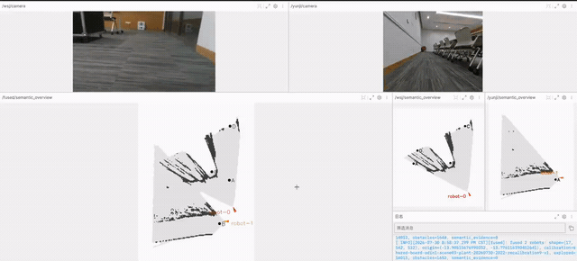<br>
      Exploration reached the test-time limit before finding and reaching a
      verified plant target; both robot trajectories were retained.<br>
      <a href="media/demo/scene03_formal_01_third_view.mp4">Third view</a> ·
      <a href="media/demo/scene03_formal_01_dashboard.mp4">Dashboard</a>
    </td>
    <td width="50%" align="center">
      <strong>Formal 02 · FAILURE</strong><br>
      <small>Third view</small><br>
      <br>
      <small>Dashboard</small><br>
      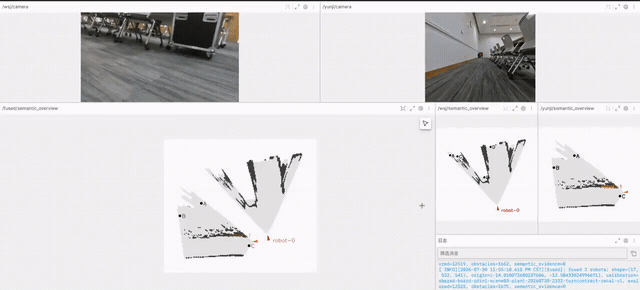<br>
      Exploration reached the test-time limit before finding and reaching a
      verified plant target; both robots finish in synchronized HOLD.<br>
      <a href="media/demo/scene03_formal_02_third_view.mp4">Third view</a> ·
      <a href="media/demo/scene03_formal_02_dashboard.mp4">Dashboard</a>
    </td>
  </tr>
  <tr>
    <td width="50%" align="center">
      <strong>Formal 03 · SUCCESS</strong><br>
      <small>Third view</small><br>
      <br>
      <small>Dashboard</small><br>
      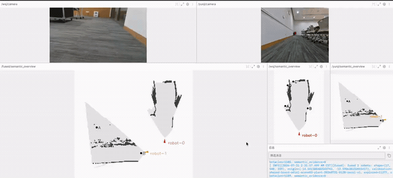<br>
      Both robots explore long-range frontiers; Robot 1 switches to the plant
      semantic region and reaches the target, confirmed by the operator.<br>
      <a href="media/demo/scene03_formal_03_third_view.mp4">Third view</a> ·
      <a href="media/demo/scene03_formal_03_dashboard.mp4">Dashboard</a>
    </td>
    <td width="50%" align="center">
      <strong>Formal 04 · SUCCESS</strong><br>
      <small>Third view</small><br>
      <br>
      <small>Dashboard</small><br>
      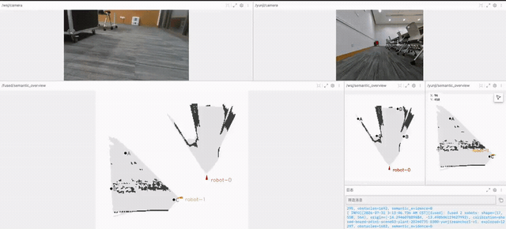<br>
      Robot 0 advances along an independent frontier while Robot 1 completes
      the plant semantic route and auto-ARRIVED, confirmed by the operator.<br>
      <a href="media/demo/scene03_formal_04_third_view.mp4">Third view</a> ·
      <a href="media/demo/scene03_formal_04_dashboard.mp4">Dashboard</a>
    </td>
  </tr>
  <tr>
    <td colspan="2" align="center">
      <strong>Formal 05 · SUCCESS</strong><br>
      <small>Third view</small><br>
      <br>
      <small>Dashboard</small><br>
      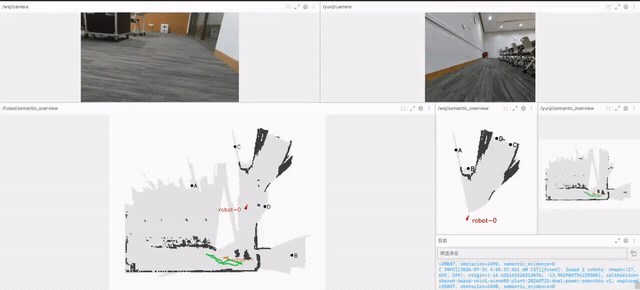<br>
      Coordinated role assignment preserves Robot 0 observations while Robot 1
      completes long-range exploration, switches to the plant semantic region
      and auto-ARRIVED, confirmed by the operator.<br>
      <a href="media/demo/scene03_formal_05_third_view.mp4">Third view</a> ·
      <a href="media/demo/scene03_formal_05_dashboard.mp4">Dashboard</a>
    </td>
  </tr>
</table>

### Per-run metrics

| Run | Result | Exploration rounds | Robot 0 trajectory | Robot 1 trajectory | Source-compatible SPL | Standard SPL |
| --- | --- | ---: | ---: | ---: | ---: | ---: |
| Formal 01 | FAILURE | `16` | `18.577107 m` | `14.162235 m` | `0.0` | `0.0` |
| Formal 02 | FAILURE | `18` | `5.754388 m` | `17.902160 m` | `0.0` | `0.0` |
| Formal 03 | SUCCESS | `5` | `9.037490 m` | `11.606679 m` | `0.689524` | `1.000000` |
| Formal 04 | SUCCESS | `6` | `9.391253 m` | `13.010775 m` | `0.693557` | `1.000000` |
| Formal 05 | SUCCESS | `11` | `0.006053 m` | `19.152683 m` | `0.446727` | `0.730968` |

[Full five-experiment archive](audit/SCENE03_PLANT_FORMAL_EXPERIMENTS_01_05_20260731.md)
· [Formal 01 failure record](audit/SCENE03_PLANT_FORMAL_EXPERIMENT_01_FAILURE_20260730.md)
· [Formal 02 failure record](audit/SCENE03_PLANT_FORMAL_EXPERIMENT_02_FAILURE_20260731.md)
· [Formal 03 success record](audit/SCENE03_PLANT_FORMAL_EXPERIMENT_03_SUCCESS_20260731.md)
· [Formal 04 success record](audit/SCENE03_PLANT_FORMAL_EXPERIMENT_04_SUCCESS_20260731.md)
· [Formal 05 success record](audit/SCENE03_PLANT_FORMAL_EXPERIMENT_05_SUCCESS_20260731.md)
· [Machine-readable results](manifests/scene03_plant_formal_experiments_20260731.json)
· [Media manifest](media/README.md)

## Scene 04 · Cooperative Plant

The currently archived run reached the 600-second test limit before finding
and reaching a verified plant target.

| Recorded trials | Success | SR | Mean source-compatible SPL | Mean Standard SPL |
| ---: | ---: | ---: | ---: | ---: |
| `1` | `0` | `0.0` | `0.0` | `0.0` |

### Real-robot rollout

<table>
  <tr>
    <td align="center">
      <strong>Formal 04 · FAILURE</strong><br>
      <small>Third view</small><br>
      <br>
      <small>Dashboard</small><br>
      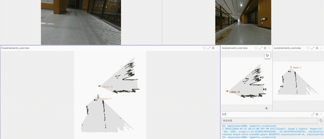<br>
      Exploration reached the 600-second test limit before finding and
      reaching a verified plant target.<br>
      <a href="media/demo/scene04_formal_04_third_view.mp4">Third view</a> ·
      <a href="media/demo/scene04_formal_04_dashboard.mp4">Dashboard</a>
    </td>
  </tr>
</table>

### Per-run metrics

| Run | Result | Exploration rounds | Robot 0 trajectory | Robot 1 trajectory | Source-compatible SPL | Standard SPL |
| --- | --- | ---: | ---: | ---: | ---: | ---: |
| Formal 04 | FAILURE | `17` | `12.917490 m` | `19.608723 m` | `0.0` | `0.0` |

[Formal 04 failure record](audit/SCENE04_PLANT_FORMAL_EXPERIMENT_04_FAILURE_20260731.md)
· [Machine-readable results](manifests/scene04_plant_formal_experiments_20260731.json)
