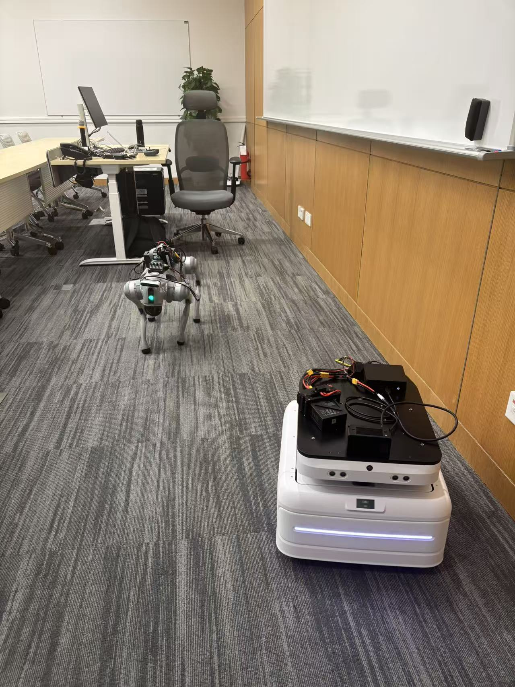
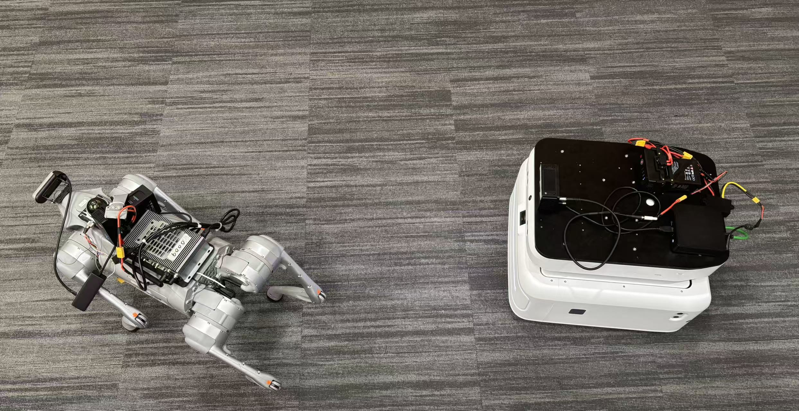
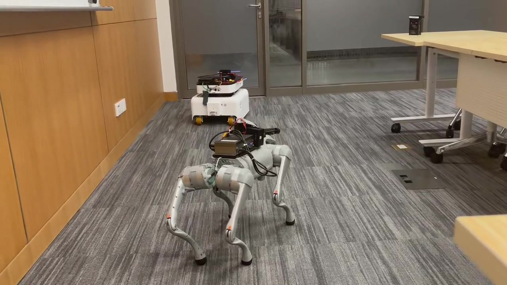
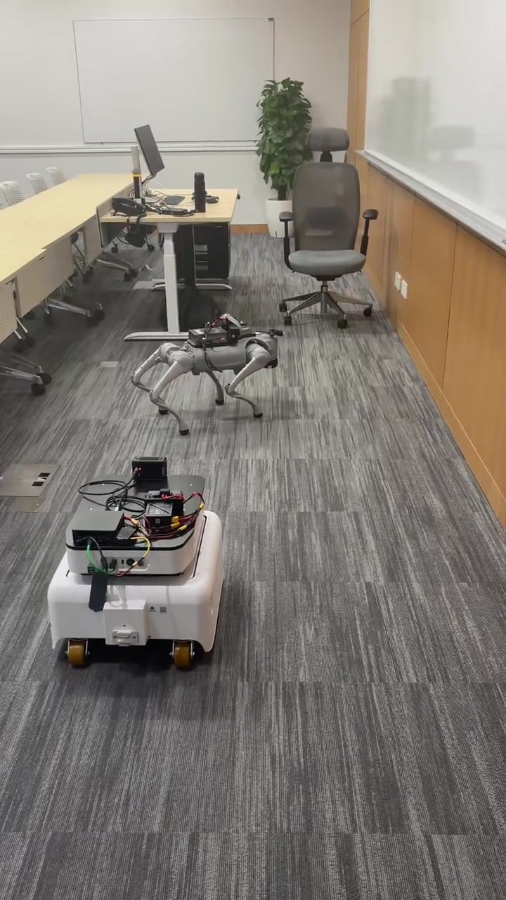
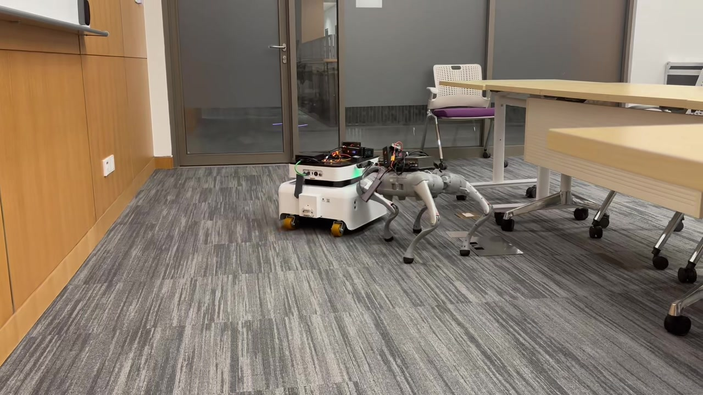
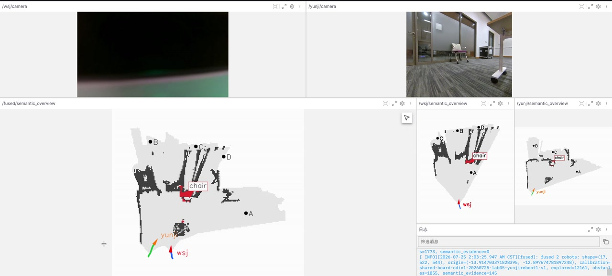
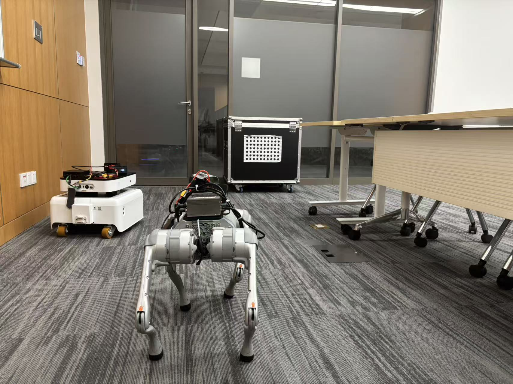
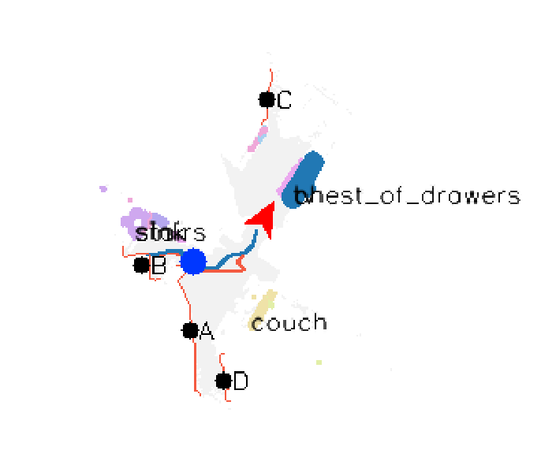
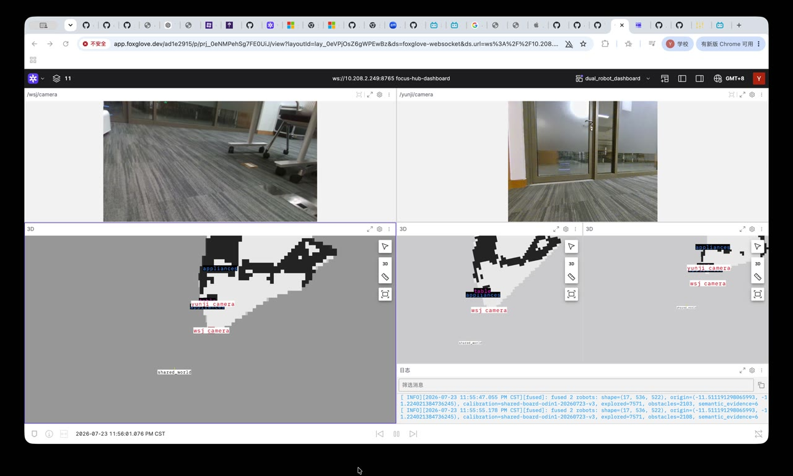

# TopoFocus Realworld

TopoFocus 的真机仓库：一台 GPU Hub 接收机器人观测、构建/融合语义地图并发布可过期的高层决策；Go2 端保留最终停止与拒绝权限。本仓库同时保存审计过的研究源码快照、Hub 实现和 WSJ Jetson 的可复现部署层。

目标仓库：`git@github.com:AlanZhu2006/topofocus_realworld.git`

## 当前结论（2026-07-25）

权威状态见 [CURRENT_STATUS.md](CURRENT_STATUS.md)。摘要如下：

- 双机真实链路已经实际跑到“观测、在线地图、VLM、高层 v2 目标、
  两台机器人本地规划与运动、本地反馈、租约续期和故障 HOLD”，但仍没有
  一次可计入 SR/SPL 的正式场景成功。
- WSJ 当前为 D435i + 修复后的 TinyNav perception/IMU + 在线
  BuildMap；Yunji 当前为 Odin1 `O1-P070100205`，不是旧的 RealSense
  路径。
- session `20260725-lab05-yunjireboot4` 在提交 `cdcd7e7` 上通过严格
  无运动 debug；随后 `scene01-chair-run01-fastfix` 给两台机器人发布了
  不同前沿并观察到两台都运动，但两条路线交叉，最终发生物理碰撞。操作者
  已确认停止，该 run 明确排除出 SR/SPL。
- 碰撞根因不是“两个机器人拿到同一个前沿”，而是源码式顺序分配只保证
  前沿不同，没有保证两条物理路线分离。提交 `b79879b` 新增
  `0.9 m` 保守路线冲突门控：保留原始双机 VLM candidate，但冲突时只放行
  一台，另一台 HOLD。事故几何 replay 和本机完整测试已通过，尚未重新真机
  验证。
- Yunji 正式链路已改为与 WSJ 相同的在线 TinyNav 架构：Odin 提供
  校正深度、位姿和世界点云，TinyNav 负责在线 occupancy、A*、局部规划
  与控制；WATER 只执行经过租约门控的 `/api/joy_control` 速度。该实现
  已完成机器人端无运动启动和真机运动观察；
  正式链路不再依赖 WATER 旧地图、`accessible_point_query`、
  `make_plan` 或 `/api/move`。
- Hub 默认及当前均为 `GOAL=false`。Hub 只发布版本化、可过期的高层
  目标；机器人端保留最终停止和拒绝权限。
- 语义图使用真实模型推理和像素 mask，但 chair/plant 等投影仍是
  `model_inference_map_projected_unverified`，不能当作真实标签。
- `example.png` 风格的双机 2D 图已经作为 WSJ、Yunji 和 fused 三个
  Foxglove Image topic 实现：像素语义、标签、轨迹、base 位姿/朝向和
  A–D 前沿同时显示；旧 relay 源码哈希不一致时一键启动会自动拒绝。
- 四场景 × 五次、标准 SPL/源码兼容 SPL 和 episode 报告已经实现；
  当前没有有效正式样本，因此 SR/SPL 暂无数值。
- 正式 `live` 已在本机接成源码节拍的多轮循环：前沿到达继续重规划，
  语义区域 `ARRIVED` 才会双机 HOLD 并自动封存终点 RGB-D/地图证据。
  第一轮物理发布、反馈和租约续期已被观察；自动多轮终止和终点封存仍待
  无碰撞真机验证。自动证据仍需独立目标标注和 surveyed
  goal-region/shortest-path 才能计入 SR/SPL。
- 事故 session 绑定旧提交，且 Odin 已重启、Go2 已下电趴下，因此不能
  直接复用。下一次必须让 Go2 站立固定后运行新的单次标定；该命令会部署
  当前提交、创建 fresh map/Foxglove 并自动完成严格 debug。

## 实机直接入口

根目录的 [`command.txt`](command.txt) 保存了未经二次封装的完整原始
命令，包括：

- 新摆位的一键标定、fresh map、Foxglove 和严格无运动 debug；
- 复用 `current` session 的 debug；
- `scene01-chair` 从 run01 到 run05 的五条独立 live 命令；
- 复制到其他 scene/goal 时必须修改的字段。

打开文件后一次只复制并运行需要的命令区块，不要把整个文本文件一次性
当作脚本执行。每个 live 命令仍要求明确的现场操作者确认。

## 真机实验平台

| 实验室场景 | 双机俯视 |
| --- | --- |
|  |  |

实验系统由两台异构机器人组成：

- **WSJ**：Unitree Go2，使用 D435i、TinyNav perception、在线
  BuildMap、TinyNav 局部规划与受保护的 Go2 速度桥；
- **Yunji**：轮式移动平台，使用 Odin1 RGB/SLAM cloud/odometry、
  在线 TinyNav 规划控制与受保护的 WATER 速度桥；
- **GPU Hub**：集中构建/融合双机语义地图，运行 YOLO 与
  Perception/Judgment/Decision VLM，并只向机器人发布可过期的高层目标。

### 第三视角真机片段

| 横屏第三视角 | 竖屏第三视角 |
| --- | --- |
| [](media/demo/third_view_failure_1_20260724.mp4) | [](media/demo/third_view_failure_2_20260724.mp4) |
| [播放 10.2 秒 MP4](media/demo/third_view_failure_1_20260724.mp4) | [播放 4.8 秒 MP4](media/demo/third_view_failure_2_20260724.mp4) |

两个片段从实验室第三视角展示 WSJ Go2、Yunji 及其实际传感器/计算设备。
仅凭视频无法可靠绑定具体 episode、session 或失败原因，因此暂按工程测试
片段保留并排除在 SR/SPL 之外；完整文件哈希和转码来源见
[`media/demo/README.md`](media/demo/README.md)。

### 已绑定的双机碰撞记录

| 第三视角 | 同期 Foxglove Dashboard |
| --- | --- |
| [](media/demo/dual_robot_collision_third_view_20260725.mp4) | [](media/demo/dual_robot_collision_dashboard_20260725.mp4) |
| [播放 12.4 秒 MP4](media/demo/dual_robot_collision_third_view_20260725.mp4) | [播放 16.3 秒 MP4](media/demo/dual_robot_collision_dashboard_20260725.mp4) |

这两个片段由用户明确绑定到 session
`20260725-lab05-yunjireboot4`、episode
`scene01-chair-run01-fastfix`。第三视角直接显示双机汇合并接触；
Dashboard 同期显示短轨迹汇合、WSJ 相机近距离遮挡和模型投影的
`chair` 区域。该 run 的终止类型是 `collision`，不计入 SR/SPL。运行时
文件、视频主文件/衍生文件哈希、网络因果边界和修复见
[双机碰撞审计](audit/DUAL_ROBOT_COLLISION_20260725.md)。

### 双机共享坐标系标定



两台相机同时观测同一块 7 × 10 对称圆点板。每个新物理摆位采集一组拟合
观测和一组独立移动后的留出观测，用于求解并验证 gravity-preserving
共享坐标变换。一键脚本先拉起双机 Foxglove preview：完整看到标定板后按
第一次 Enter 计算初始拟合，只移动标定板后按第二次 Enter 完成 holdout、
部署和无运动 debug；机器人在标定阶段没有运动命令路径。

### 语义 2D 地图展示目标



这张图是用户提供的可视化目标参考：最终 Foxglove 2D 图应同时清晰呈现
机器人位姿、轨迹、可通行/障碍区域、像素级语义色块和类别标签。它不是
当前算法准确率或成功场景截图。

2026-07-24 的完整复核已用当前双机快照生成并通过协议订阅验证上述三张
图；renderer 不会把 RGBA 下采样混色当成新类别，也不会让静止定时刷新
冒充第二个语义视角。现存 v12 图仍是历史模型推理证据，不会被事后清洗；
详细根因、哈希和验证边界见
[语义 2D/Foxglove 复核](audit/SEMANTIC_OVERVIEW_REAUDIT_20260724.md)。

已经运行过的失败 demo 会持续收录到
[`media/demo/`](media/demo/README.md)，并注明对应 episode、观察到的失败
原因和是否计入指标。失败 demo 作为可复现排障材料保留，不计入 SR/SPL
成功样本。

首个公开片段记录了早期 Foxglove 双机 dashboard 中相机画面正常、但 2D
占据/语义地图呈现射线状和不规则区域的问题：

[](media/demo/dashboard_failure_20260724.mp4)

[播放 24 秒 MP4](media/demo/dashboard_failure_20260724.mp4)。该片段是失败
现象展示，不对应可计入指标的正式 episode；地图原因与后续修复证据见
[实时地图恢复审计](audit/LIVE_MAP_RECOVERY_20260722.md)。

## 从干净克隆开始

```bash
git clone git@github.com:AlanZhu2006/topofocus_realworld.git
cd topofocus_realworld

# 只安装轻量 Hub/测试依赖，不下载模型或仿真数据。
bash hub/scripts/bootstrap_dev.sh
bash hub/scripts/verify_repository.sh --tests
```

完整 GPU 推理还需要仓库外的 RedNet、YOLO、CLIP 和 GLM 权重。它们的固定路径、大小和 SHA-256 见 `manifests/artifacts.json`；Git 不保存模型、录包、地图、token 或虚拟环境。

## 在另一台 Go2 Jetson 上复现

以下步骤只构造源码和检查环境，不会移动机器人：

```bash
git clone https://github.com/AlanZhu2006/topofocus_realworld.git
cd topofocus_realworld

# 从固定 TinyNav 上游 commit 重建 WSJ 已验证源码状态。
bash hub/robot_overlay/bootstrap_go2.sh \
  --destination /home/nvidia/twork/tinynav-topofocus

# 先查看，再显式安装 USB 稳定性配置。
bash hub/robot_overlay/install_go2_host_config.sh
sudo bash hub/robot_overlay/install_go2_host_config.sh --apply

# 只读检查；--hardware 要求 D435i 已连接且 power/control=on。
bash hub/robot_overlay/verify_go2.sh --hardware --tests
```

环境检查全部通过、操作者在现场后，才可启动“相机 + perception”观测栈：

```bash
cp hub/robot_overlay/config/go2.env.example hub/robot_overlay/go2.env
bash hub/robot_overlay/start_go2_observation.sh \
  --env hub/robot_overlay/go2.env
```

这个入口明确不启动 planner、`cmd_vel`、Unitree bridge 或 Hub GOAL receiver。原生 BuildMap 的人工移动与安全保存步骤见 [复现手册](docs/REPRODUCE.md)。

## 仓库边界

| 路径 | 作用 | Git 策略 |
| --- | --- | --- |
| `source/Focus_realworld/` | 原始集中式 Habitat/TopoFocus 研究代码 | 只读快照，逐文件校验 |
| `dependencies/` | RedNet 与修改版 Habitat 参考源码 | 只读快照，逐文件校验 |
| `hub/` | 真机协议、Hub、工具、测试和机器人部署层 | 主开发区 |
| `hub/robot_overlay/tinynav_snapshot/` | WSJ 所用 TinyNav 固定基线补丁与实验快照 | 可审计、可重建 |
| `audit/` | 已观察结果与门禁证据 | 入库 |
| `media/` | 真机设备展示、标定照片与公开 demo 索引 | 入库；每个素材记录来源/哈希 |
| `manifests/` | 来源、环境、外部资产和 SHA-256 | 入库 |
| `artifacts/`, `data/`, `logs/`, `hub/runtime/` | 权重、录包、地图、日志、token、运行状态 | 永不入库 |

不要在 `source/` 或 `dependencies/` 中开发部署代码；新真机代码只进入 `hub/`。

## 文档入口

- [当前权威状态、已验证边界和下一步](CURRENT_STATUS.md)
- [历史审计索引](audit/README.md)
- [2026-07-25 双机碰撞、视频证据与路线冲突修复](audit/DUAL_ROBOT_COLLISION_20260725.md)
- [从零复现本机与新 Go2](docs/REPRODUCE.md)
- [WSJ 已观察基线与遗留问题](docs/WSJ_BASELINE_20260721.md)
- [Git 分支、发布与快照更新规则](docs/GIT_WORKFLOW.md)
- [系统架构](ARCHITECTURE.md)
- [操作与验证门禁](RUNBOOK.md)
- [持久标定、无运动调试与正式实验一键流程](hub/docs/ONECLICK_SESSION_WORKFLOW.md)
- [传输协议](hub/docs/TRANSPORT.md)
- [v2 双机真机最短上线清单](hub/docs/V2_PHYSICAL_QUICKSTART.md)
- [坐标系约束](hub/docs/COORDINATE_FRAMES.md)
- [实时地图与 Foxglove 契约](hub/docs/LIVE_MAPPING.md)
- [双机 VLM 影子调度实测](audit/LIVE_VLM_SHADOW_20260722.md)
- [HPC 源码派生连续 VLM 场景与边界](audit/SOURCE_DERIVED_VLM_SCENE_RUNNER_20260723.md)
- [WSJ 重启后明日就绪检查](audit/WSJ_POST_REBOOT_READINESS_20260722.md)
- [2026-07-23 真机 VLM 最短流程](hub/docs/VLM_LIVE_EXPERIMENT_20260723.md)
- [Yunji Odin1 替换部署、校验与重新标定](hub/docs/YUNJI_ODIN1_DEPLOYMENT.md)
- [离线地图诊断、移动验收和既有标定脚本复用](hub/docs/OFFLINE_MAP_VALIDATION.md)
- [来源与第三方说明](SOURCE_MANIFEST.md)

任何让机器人运动的工作都必须另行通过标定、replay、超时/断网、急停和 HIL 门禁；克隆或运行本仓库的默认脚本本身不构成运动授权。
