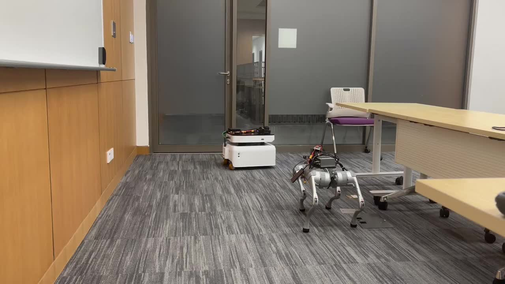
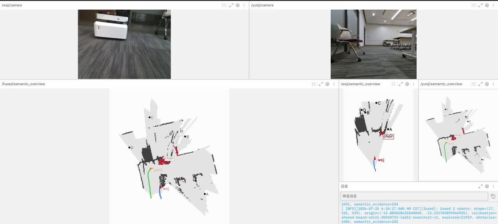
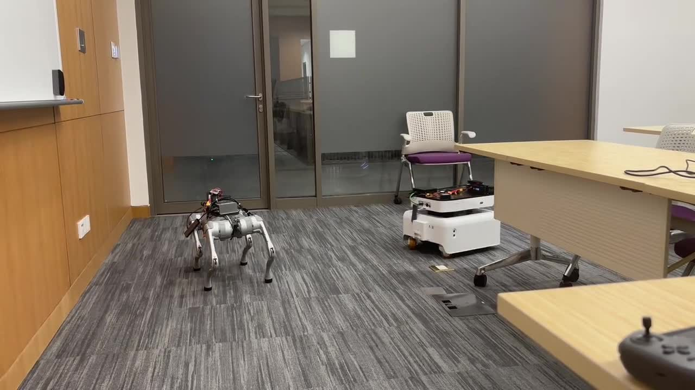
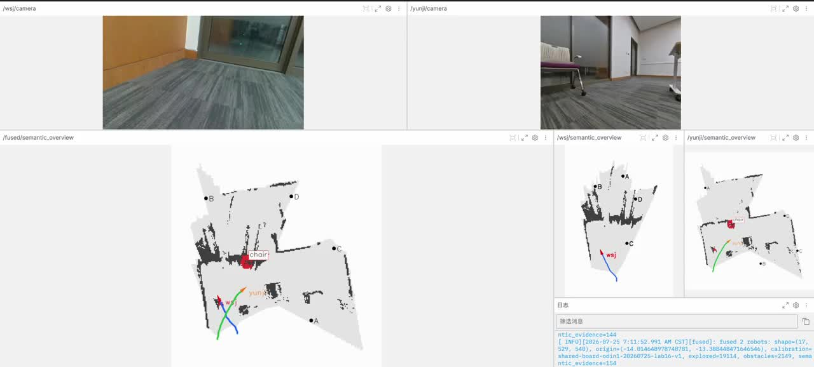
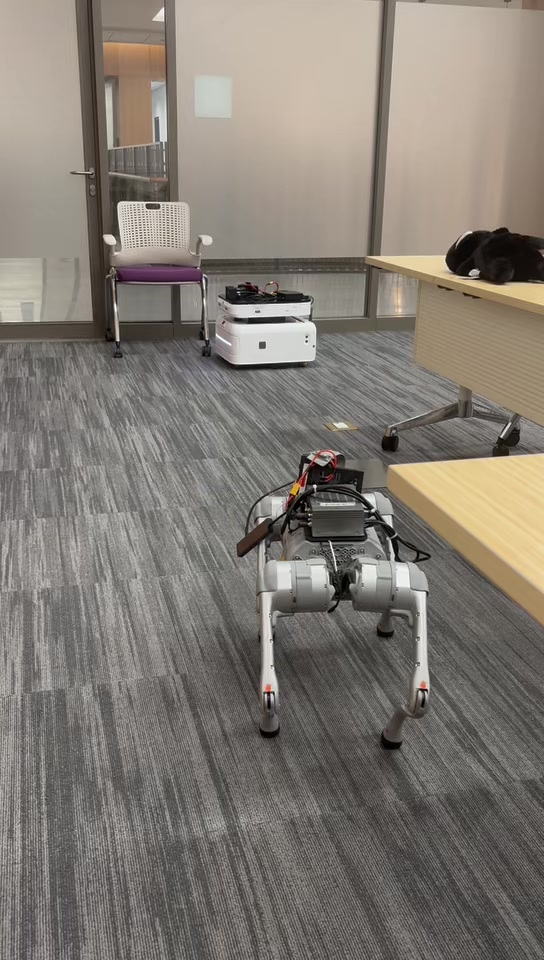
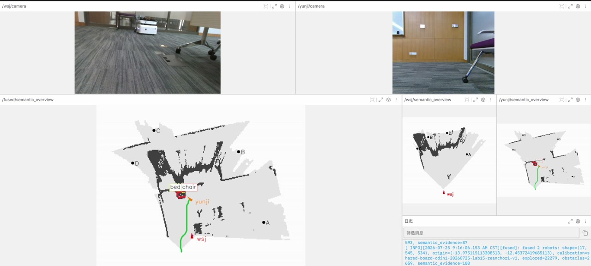
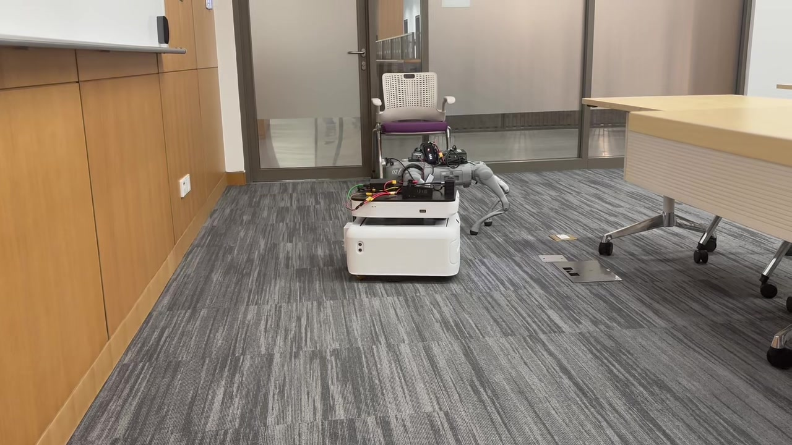
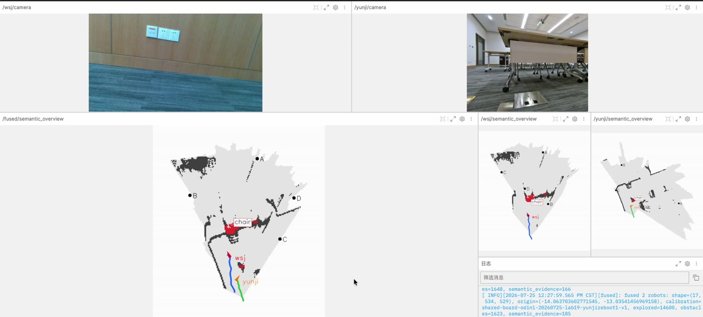

# TopoFocus Realworld

TopoFocus 的真机仓库：一台 GPU Hub 接收机器人观测、构建/融合语义地图并发布可过期的高层决策；Go2 端保留最终停止与拒绝权限。本仓库同时保存审计过的研究源码快照、Hub 实现和 WSJ Jetson 的可复现部署层。

目标仓库：`git@github.com:AlanZhu2006/topofocus_realworld.git`

## 当前结论（2026-07-25）

权威状态见 [CURRENT_STATUS.md](CURRENT_STATUS.md)。摘要如下：

- 双机真实链路已经实际跑到“观测、在线地图、VLM、高层 v2 目标、
  两台机器人本地规划与运动、本地反馈、租约续期和故障 HOLD”。Scene 01
  当前已有三个进入独立 `0.5 m` 真机轨的成功样本。操作者明确将
  `trial-05-nearwall-fix` 标为第三次正式实验（手动终点判定成功），将
  最新 `20260725-lab21-wallfix-imudebounce-3a2d953 /
  trial-wallfix-imudebounce-r1` 标为第四次正式实验（成功）；最新 run
  由 Yunji 本地规划器自动返回 `ARRIVED` 并封存终点证据。
- WSJ 当前为 D435i + 修复后的 TinyNav perception/IMU + 在线
  BuildMap；Yunji 当前为 Odin1 `O1-P070100205`，不是旧的 RealSense
  路径。
- session `20260725-lab05-yunjireboot4` 在提交 `cdcd7e7` 上通过严格
  无运动 debug；随后 `scene01-chair-run01-fastfix` 给两台机器人发布了
  不同前沿并观察到两台都运动，但两条路线交叉，最终发生物理碰撞。操作者
  已确认停止，该 run 明确排除出 SR/SPL。
- 碰撞根因不是“两个机器人拿到同一个前沿”，而是源码式顺序分配只保证
  前沿不同，没有保证两条物理路线分离。提交 `b79879b` 新增
  `0.9 m` 保守路线冲突门控：保留原始双机 VLM candidate，但冲突时只放行
  一台，另一台 HOLD。最新真机 run 三轮都观察到该串行化生效：WSJ/Yunji
  不再同时穿越冲突路线。
- 后续 `trial-reanchor1-r2` 又暴露了不同的问题：Yunji 收到的前沿落点
  靠墙，0.5 m 到达范围内没有满足机体净空的已知自由栅格，局部路径随后
  要求倒车，而原 forward-only 控制器会朝该反向段旋转。现在发布前会
  单独检查前沿落脚净空；运行时遇到反向段会立即封零并只撤销该机器人的
  前沿腿，另一台继续。原始 VLM candidate 仍完整保留。证据见
  [Yunji 墙向转动审计](audit/YUNJI_WALL_TURN_REJECTION_20260725.md)。
- Yunji 正式链路已改为与 WSJ 相同的在线 TinyNav 架构：Odin 提供
  校正深度、位姿和世界点云，TinyNav 负责在线 occupancy、A*、局部规划
  与控制；WATER 只执行经过租约门控的 `/api/joy_control` 速度。该实现
  已完成机器人端无运动启动和真机运动观察；
  正式链路不再依赖 WATER 旧地图、`accessible_point_query`、
  `make_plan` 或 `/api/move`。
- Hub 默认及当前均为 `GOAL=false`。Hub 只发布版本化、可过期的高层
  目标；机器人端保留最终停止和拒绝权限。
- 语义图使用真实模型推理和像素 mask，但 chair/plant 等投影仍是
  `model_inference_map_projected_unverified`，不能当作真实标签。
- `example.png` 风格的双机 2D 图已经作为 WSJ、Yunji 和 fused 三个
  Foxglove Image topic 实现：像素语义、标签、轨迹、base 位姿/朝向和
  A–D 前沿同时显示；旧 relay 源码哈希不一致时一键启动会自动拒绝。
- 四场景 × 五次、标准 SPL/源码兼容 SPL 和 episode 报告已经实现。当前
  `physical_0p5m_protocol` 轨已有 3 个证据绑定的正常通过样本：
  `SR=3/3=1.0`、平均源码兼容 `SPL=0.816269`。操作者确认 Formal 4 的
  `L≈3.25 m` 是独立测量的最短可行路径，因此标准轨已有 1 个样本：
  `SR=1/1=1.0`、standard SPL `1.0`。
- 正式 `live` 已在本机接成源码节拍的多轮循环：前沿到达继续重规划，
  语义区域 `ARRIVED` 才会双机 HOLD 并自动封存终点 RGB-D/地图证据。
  r5 已在无碰撞真机运行中观察到自动多轮终止、双机 HOLD 和终点封存。
  没有预先 surveyed shortest path 的样本只能进入单独的 0.5 m 实机轨，
  不能生成标准 SPL。
- 新 session `20260725-lab12` 已完成双位置圆点板标定、fresh 双机地图和
  严格无运动 debug；操作者已确认最新 Foxglove 地图正常。随后只是 Go2
  底盘充电下电，WSJ Jetson/perception SLAM 仍持续运行，因此该事件本身不要求重新
  标定。
- session `20260725-lab17-nearwall-fix` 随后完成三轮真机运动：Yunji 在
  第三轮检测到 chair 并停在语义落点 `0.321 m` 内。旧 `0.15 m` 到达门限
  先触发 `LOCAL_PLANNER_PATH_STALE`；提交 `b1762d1` 已把两台真机 launcher
  的语义到达半径显式设为 `0.5 m`，该路径已在 r5 自动
  `LOCAL_PLANNER_ARRIVED` 中得到真机验证。
- Yunji 在该 run 后于 09:26 重启，Odin driver 于 09:27 重新进入 active；
  tracking epoch 已改变。随后准备 `20260725-lab18-repeat2` 时，Go2 又被
  移到充电位，因此这次不能再走 stationary re-anchor；lab18 在出板结果前
  已安全中止。Go2 回到新起点后必须用新 session 做完整双位置板标定。
- lab18 启动还发现 WSJ/Yunji 发布根目录中的交叉 launcher 版本不一致；
  两个文件已原子同步，之后双端完整字节校验通过。该问题只影响发布一致性
  门禁，没有产生运动。记录见
  [lab18 标定中止审计](audit/LAB18_CALIBRATION_ABORT_20260725.md)。
- 一键流程已加入 tracking-epoch 判定和热复用：底盘单独上下电可直接进入
  下一次 live；WSJ perception/SLAM 或 Yunji Odin 真正重启才会在发布目标前
  拒绝旧标定。同一 session 的后续实验并行切换双机接收器，结束时只移除
  底盘命令链，保留相机、TinyNav、地图和 Foxglove。该加速路径已通过本机
  回归测试，下一次上机需记录实际启动耗时。
- r5 成功后准备 r6 时，操作者在 live 前从 Foxglove 发现 WSJ 融合位姿
  靠近/进入另一台地图的墙体。冻结数据复核显示 WSJ 位姿距自身地图障碍
  `3.131 m`，但距 Yunji 地图障碍仅 `0.224 m`；相对双机几何较 r5 改变
  `0.602 m` 和约 `13.8°`。r6 因此作为标定漂移预检中止，不发布目标、
  不形成 episode、不进入 SR/SPL。两台机器人随后下电充电；下次必须重新
  做完整双位置板标定并先检查 fused overview。
- 第五次正式实验的两次准备也都在严格无运动 debug 内中止，没有进入
  live、发布 GOAL、创建 episode 或产生运动。当前边界重试发现 WSJ 原始
  D435i 数据仍在线，但校正 camera-info/视觉里程计输出已冻结；旧 lab21
  变换不能直接复用。操作者已将两台机器人下电充电并明确暂缓标定，因此
  Formal 5 没有 SR/SPL 行。见
  [第五次预检中止审计](audit/FORMAL_EXPERIMENT_05_PREFLIGHT_ABORT_20260725.md)。

## 实机直接入口

根目录的 [`command.txt`](command.txt) 保存了未经二次封装的完整原始
命令，包括：

- 新摆位的一键标定、fresh map、Foxglove 和严格无运动 debug；
- 只在诊断时强制重跑 `current` session 的 debug；
- 默认复用已验证 tracking/TinyNav/map/Foxglove 的快速 live，以及可选
  `--full-preflight` 恢复命令；
- `scene01-chair` 从 run01 到 run05 的五条独立 live 命令；
- 复制到其他 scene/goal 时必须修改的字段。

打开文件后一次只复制并运行需要的命令区块，不要把整个文本文件一次性
当作脚本执行。每个 live 命令仍要求明确的现场操作者确认。

## 真机实验平台

| 实验室场景 | 双机俯视 |
| --- | --- |
|  |  |

实验系统由两台异构机器人组成：

- **WSJ**：Unitree Go2，使用 D435i、TinyNav perception、在线
  BuildMap、TinyNav 局部规划与受保护的 Go2 速度桥；
- **Yunji**：轮式移动平台，使用 Odin1 RGB/SLAM cloud/odometry、
  在线 TinyNav 规划控制与受保护的 WATER 速度桥；
- **GPU Hub**：集中构建/融合双机语义地图，运行 YOLO 与
  Perception/Judgment/Decision VLM，并只向机器人发布可过期的高层目标。

### 第一个真机场景：Scene 01 — Chair

第一个实验场景要求两台机器人从同一实验室起始区域在线建图、协调探索并
找到白色椅子。当前媒体记录包含两次由操作者命名的 approach failure 和
两次正常通过；最新第四次正式实验先按 runtime/终点证据归档，尚未把任何
现场视频事后绑定到该 episode。第五次只完成无运动预检且中止，不是
episode。媒体列明确标出可用性。

| Run | 结果 | 归因 | SR | Source-compatible SPL | 第三视角 | Foxglove Dashboard | 证据口径 |
| --- | --- | --- | ---: | ---: | --- | --- | --- |
| Failure 1 | **FAILURE** | 未分类：缺少 runtime 绑定 | 排除 | 排除 | [](media/demo/scene01_failure_1_third_view_20260725.mp4)<br>[H.264](media/demo/scene01_failure_1_third_view_20260725.mp4) · [原始 HEVC](media/video/third_view/experiment_1/experiment_1_approach_failure_1.mp4) | [](media/demo/scene01_failure_1_dashboard_20260725.mp4)<br>[H.264](media/demo/scene01_failure_1_dashboard_20260725.mp4) · [原始 MOV](media/video/dashboard/experiment_1/experiment_1_approach_failure_1_dashboard.mov) | 用户文件名标记为 `approach_failure_1`；第三视角末端 Yunji 停在门边，未建立可计入指标的目标终点。具体 runtime episode ID/控制器错误码未独立绑定，不能认定为 VLM 失败。 |
| Failure 2 | **FAILURE** | 未分类：缺少 runtime 绑定 | 排除 | 排除 | [](media/demo/scene01_failure_2_third_view_20260725.mp4)<br>[H.264](media/demo/scene01_failure_2_third_view_20260725.mp4) · [原始 HEVC](media/video/third_view/experiment_1/experiment_1_approach_failure_2.mp4) | [](media/demo/scene01_failure_2_dashboard_20260725.mp4)<br>[H.264](media/demo/scene01_failure_2_dashboard_20260725.mp4) · [原始 MOV](media/video/dashboard/experiment_1/experiment_1_approach_failure_2.mov) | 用户文件名标记为 `approach_failure_2`；Yunji 向椅子区域推进，但没有被验证为有效自动终点。缺少逐轮决策/控制证据，不能认定为 VLM 失败。 |
| Formal 3 | **SUCCESS** | 操作者手动终点判定 | `1` | `0.864048` | [](media/demo/scene01_success_third_view_20260725.mp4)<br>[H.264](media/demo/scene01_success_third_view_20260725.mp4) · [原始 HEVC](media/video/third_view/experiment_1/experiment_1_success_3.mp4) | [](media/demo/scene01_success_dashboard_20260725.mp4)<br>[H.264](media/demo/scene01_success_dashboard_20260725.mp4) · [原始 MOV](media/video/dashboard/experiment_1/experiment_1_success_3_dashboard.mov) | `20260725-lab17-nearwall-fix / trial-05-nearwall-fix`；Yunji 停在所选 chair 语义落点 `0.321133 m` 内，操作者按 `0.5 m` 真机半径标注第三次正式实验成功。 |
| Success 2 | **SUCCESS** | 正常通过 | `1` | `0.628399` | [](media/demo/scene01_success_2_third_view_20260725.mp4)<br>[H.264](media/demo/scene01_success_2_third_view_20260725.mp4) · [原始 HEVC](media/video/third_view/experiment_1/experiment_1_success_1.mp4) | [](media/demo/scene01_success_2_dashboard_20260725.mp4)<br>[H.264](media/demo/scene01_success_2_dashboard_20260725.mp4) · [原始 MOV](media/video/dashboard/experiment_1/experiment_1_success_1_dashboard.mov) | `20260725-lab19-scene01-8ca1d52-yunjireboot1-r5 / trial-r5-01`；WSJ 本地规划器自动 `ARRIVED`，停点距 chair 语义目标 `0.406693 m`，正常通过。 |
| Formal 4 | **SUCCESS** | 自动 `ARRIVED` + 操作者归档 | `1` | `0.956361` | 未绑定现场视频；[终点证据审计](audit/SCENE01_CHAIR_FORMAL_EXPERIMENT_04_SUCCESS_20260725.md) | 未绑定 Dashboard | `20260725-lab21-wallfix-imudebounce-3a2d953 / trial-wallfix-imudebounce-r1`；Yunji 自动 `LOCAL_PLANNER_ARRIVED`、零速停止，终点 RGB 可见白椅，操作者明确归档为第四次正式实验成功。 |
| Formal 5 preflight | **NOT STARTED** | WSJ tracking 输出冻结 | 排除 | 排除 | 候选媒体未绑定/提交 | 候选媒体未绑定/提交 | 两次准备均止于严格无运动 debug；无 live、GOAL、episode 或运动，不计 SR/SPL。见[预检中止审计](audit/FORMAL_EXPERIMENT_05_PREFLIGHT_ABORT_20260725.md)。 |

| 当前计入指标的样本 | Success | SR | Mean source-compatible SPL | Standard SPL |
| ---: | ---: | ---: | ---: | --- |
| `3` | `3` | `1.0` | `0.816269` | Formal 4：`1.0`（标准轨 `1/1`） |

失败归因采用固定顺序：先检查传感器、标定/融合、地图/定位、传输、
本地规划控制、硬件/供电和安全中止；这些任一异常都归为工程失败，不能写成
VLM 失败。工程链健康后，YOLO/SegFormer 的漏检或误检归为 perception
failure；只有输入语义合理、目标执行正常，而 Perception/Judgment/Decision
VLM 在完整预算内持续选择错误方向、历史点或前沿，才归为 VLM decision
failure。当前已绑定的碰撞属于路线协调工程失败，r6 属于标定/融合预检
失败，Formal 5 属于 WSJ tracking 输出冻结的预检工程失败；三者都不是
VLM 失败。完整口径见
[失败归因协议](audit/FAILURE_ATTRIBUTION_PROTOCOL_20260725.md)。

Success 判定采用项目当前正式的 `0.5 m` 真机终点半径。Formal 3 的终点
距离为 `0.321133 m`，源码兼容 `SPL=0.864048`；r5 成功的终点距离为
`0.406693 m`，源码兼容 `SPL=0.628399`；Formal 4 的位移/实际路径为
`3.070130/3.210222 m`，源码兼容 `SPL=0.956361`。因此当前三个证据绑定的
实机样本为 `SR=3/3=1.0`，平均源码兼容 `SPL=0.816269`。Formal 3 运行时
接收器仍配置旧 `0.15 m` 阈值，历史日志原样保留；r5 与 Formal 4 均自动
产生 `LOCAL_PLANNER_ARRIVED` 和终点证据包。Formal 3 和 r5 尚无独立测量
最短可行路径，因此没有 standard SPL。操作者明确确认 Formal 4 的近似
`L≈3.25 m` 是独立测量最短可行路径；按 `S×L/max(P,L)`，其正式 standard
SPL 为 `1.0`。`L` 比里程计记录的实际路径约长 `0.039778 m`，因此公式由
`max(L,P)` 正常封顶为 `1.0`。完整计算见
[首次成功审计](audit/SCENE01_CHAIR_SUCCESS_20260725.md) 和
[第二次成功审计](audit/SCENE01_CHAIR_SUCCESS_R5_20260725.md)，以及
[第四次正式实验审计](audit/SCENE01_CHAIR_FORMAL_EXPERIMENT_04_SUCCESS_20260725.md)。


该截图保留 Yunji 的绿色轨迹、两台机器人位姿、A–D 前沿及 `chair` 投影。
底部 `plant` 色块是未经独立验证的模型输出，不作为真实目标或成功证据。

Scene 01 已归档的 12 个原始视频已全部通过 Git LFS 进入仓库：

| 记录组 | 第三视角原始文件 | Dashboard 原始文件 | 状态 |
| --- | --- | --- | --- |
| 初始记录 | [`experiment_1.mp4`](media/video/third_view/experiment_1/experiment_1.mp4) | [`experiment_1_dashboard.mov`](media/video/dashboard/experiment_1/experiment_1_dashboard.mov) | 原始场景记录；精确 episode/outcome 未绑定 |
| 碰撞记录 | [`experiment_1_collision.mp4`](media/video/third_view/experiment_1/experiment_1_collision.mp4) | [`experiment_1_collision_dashboard.mov`](media/video/dashboard/experiment_1/experiment_1_collision_dashboard.mov) | 已绑定碰撞，排除在 SR/SPL 外 |
| Failure 1 | [`experiment_1_approach_failure_1.mp4`](media/video/third_view/experiment_1/experiment_1_approach_failure_1.mp4) | [`experiment_1_approach_failure_1_dashboard.mov`](media/video/dashboard/experiment_1/experiment_1_approach_failure_1_dashboard.mov) | 用户标注 failure；指标排除 |
| Failure 2 | [`experiment_1_approach_failure_2.mp4`](media/video/third_view/experiment_1/experiment_1_approach_failure_2.mp4) | [`experiment_1_approach_failure_2.mov`](media/video/dashboard/experiment_1/experiment_1_approach_failure_2.mov) | 用户标注 failure；指标排除 |
| Formal 3 | [`experiment_1_success_3.mp4`](media/video/third_view/experiment_1/experiment_1_success_3.mp4) | [`experiment_1_success_3_dashboard.mov`](media/video/dashboard/experiment_1/experiment_1_success_3_dashboard.mov) | 操作者手动标注第三次正式实验；0.5 m 真机协议正常通过 |
| Success 2 | [`experiment_1_success_1.mp4`](media/video/third_view/experiment_1/experiment_1_success_1.mp4) | [`experiment_1_success_1_dashboard.mov`](media/video/dashboard/experiment_1/experiment_1_success_1_dashboard.mov) | 自动 `ARRIVED`；0.5 m 真机协议正常通过 |

工作区另有三份 `success_2`/`success_4` 候选媒体，尚未建立精确 runtime
绑定，也未提交；本轮文档整理没有移动或修改它们。其字节数、时长和哈希见
[第五次预检中止审计](audit/FORMAL_EXPERIMENT_05_PREFLIGHT_ABORT_20260725.md)。

所有主文件和公开衍生文件的字节数、时长、SHA-256 与事实边界见
[`media/README.md`](media/README.md) 和
[Scene 01 媒体发布审计](audit/SCENE01_MEDIA_PUBLICATION_20260725.md)。

### 其他第三视角真机片段

| 横屏第三视角 | 竖屏第三视角 |
| --- | --- |
| [](media/demo/third_view_failure_1_20260724.mp4) | [](media/demo/third_view_failure_2_20260724.mp4) |
| [播放 10.2 秒 MP4](media/demo/third_view_failure_1_20260724.mp4) | [播放 4.8 秒 MP4](media/demo/third_view_failure_2_20260724.mp4) |

两个片段从实验室第三视角展示 WSJ Go2、Yunji 及其实际传感器/计算设备。
仅凭视频无法可靠绑定具体 episode、session 或失败原因，因此暂按工程测试
片段保留并排除在 SR/SPL 之外；完整文件哈希和转码来源见
[`media/demo/README.md`](media/demo/README.md)。

### 已绑定的双机碰撞记录

| 第三视角 | 同期 Foxglove Dashboard |
| --- | --- |
| [](media/demo/dual_robot_collision_third_view_20260725.mp4) | [](media/demo/dual_robot_collision_dashboard_20260725.mp4) |
| [播放 12.4 秒 MP4](media/demo/dual_robot_collision_third_view_20260725.mp4) | [播放 16.3 秒 MP4](media/demo/dual_robot_collision_dashboard_20260725.mp4) |

这两个片段由用户明确绑定到 session
`20260725-lab05-yunjireboot4`、episode
`scene01-chair-run01-fastfix`。第三视角直接显示双机汇合并接触；
Dashboard 同期显示短轨迹汇合、WSJ 相机近距离遮挡和模型投影的
`chair` 区域。该 run 的终止类型是 `collision`，不计入 SR/SPL。运行时
文件、视频主文件/衍生文件哈希、网络因果边界和修复见
[双机碰撞审计](audit/DUAL_ROBOT_COLLISION_20260725.md)。

### 双机共享坐标系标定


两台相机同时观测同一块 7 × 10 对称圆点板。只有新物理摆位、传感器安装
变化或无法证明静止连续性时，才采集一组拟合观测和一组独立移动后的留出
观测，用于求解并验证 gravity-preserving 共享坐标变换。一键脚本先拉起
双机 Foxglove preview：完整看到标定板后按第一次 Enter 计算初始拟合，
只移动标定板后按第二次 Enter 完成 holdout、部署和无运动 debug；机器人
在标定阶段没有运动命令路径。单独给底盘下电不会改变相机外参；运行脚本
会用 tracking 进程 epoch 判断是否可以直接复用。若把整台机器人移到充电
位或重新摆放，则共享物理位置已经改变，必须使用新 session 重新做完整
双位置板标定。

### 语义 2D 地图展示目标


这张图是用户提供的可视化目标参考：最终 Foxglove 2D 图应同时清晰呈现
机器人位姿、轨迹、可通行/障碍区域、像素级语义色块和类别标签。它不是
当前算法准确率或成功场景截图。

2026-07-24 的完整复核已用当前双机快照生成并通过协议订阅验证上述三张
图；renderer 不会把 RGBA 下采样混色当成新类别，也不会让静止定时刷新
冒充第二个语义视角。现存 v12 图仍是历史模型推理证据，不会被事后清洗；
详细根因、哈希和验证边界见
[语义 2D/Foxglove 复核](audit/SEMANTIC_OVERVIEW_REAUDIT_20260724.md)。

已经运行过的失败 demo 会持续收录到
[`media/demo/`](media/demo/README.md)，并注明对应 episode、观察到的失败
原因和是否计入指标。失败 demo 作为可复现排障材料保留，不计入 SR/SPL
成功样本。

首个公开片段记录了早期 Foxglove 双机 dashboard 中相机画面正常、但 2D
占据/语义地图呈现射线状和不规则区域的问题：

[](media/demo/dashboard_failure_20260724.mp4)

[播放 24 秒 MP4](media/demo/dashboard_failure_20260724.mp4)。该片段是失败
现象展示，不对应可计入指标的正式 episode；地图原因与后续修复证据见
[实时地图恢复审计](audit/LIVE_MAP_RECOVERY_20260722.md)。

## 从干净克隆开始

```bash
git clone git@github.com:AlanZhu2006/topofocus_realworld.git
cd topofocus_realworld

# 拉取完整 Scene 01 原始视频；网页播放用 H.264 衍生版仍在普通 Git 中。
git lfs install
git lfs pull --include="media/video/**"

# 只安装轻量 Hub/测试依赖，不下载模型或仿真数据。
bash hub/scripts/bootstrap_dev.sh
bash hub/scripts/verify_repository.sh --tests
```

完整 GPU 推理还需要仓库外的 RedNet、YOLO、CLIP 和 GLM 权重。它们的固定路径、大小和 SHA-256 见 `manifests/artifacts.json`；Git 不保存模型、录包、地图、token 或虚拟环境。

## 在另一台 Go2 Jetson 上复现

以下步骤只构造源码和检查环境，不会移动机器人：

```bash
git clone https://github.com/AlanZhu2006/topofocus_realworld.git
cd topofocus_realworld

# 从固定 TinyNav 上游 commit 重建 WSJ 已验证源码状态。
bash hub/robot_overlay/bootstrap_go2.sh \
  --destination /home/nvidia/twork/tinynav-topofocus

# 先查看，再显式安装 USB 稳定性配置。
bash hub/robot_overlay/install_go2_host_config.sh
sudo bash hub/robot_overlay/install_go2_host_config.sh --apply

# 只读检查；--hardware 要求 D435i 已连接且 power/control=on。
bash hub/robot_overlay/verify_go2.sh --hardware --tests
```

环境检查全部通过、操作者在现场后，才可启动“相机 + perception”观测栈：

```bash
cp hub/robot_overlay/config/go2.env.example hub/robot_overlay/go2.env
bash hub/robot_overlay/start_go2_observation.sh \
  --env hub/robot_overlay/go2.env
```

这个入口明确不启动 planner、`cmd_vel`、Unitree bridge 或 Hub GOAL receiver。原生 BuildMap 的人工移动与安全保存步骤见 [复现手册](docs/REPRODUCE.md)。

## 仓库边界

| 路径 | 作用 | Git 策略 |
| --- | --- | --- |
| `source/Focus_realworld/` | 原始集中式 Habitat/TopoFocus 研究代码 | 只读快照，逐文件校验 |
| `dependencies/` | RedNet 与修改版 Habitat 参考源码 | 只读快照，逐文件校验 |
| `hub/` | 真机协议、Hub、工具、测试和机器人部署层 | 主开发区 |
| `hub/robot_overlay/tinynav_snapshot/` | WSJ 所用 TinyNav 固定基线补丁与实验快照 | 可审计、可重建 |
| `audit/` | 已观察结果与门禁证据 | 入库 |
| `media/` | 真机设备展示、标定照片与公开 demo 索引 | 入库；每个素材记录来源/哈希 |
| `manifests/` | 来源、环境、外部资产和 SHA-256 | 入库 |
| `artifacts/`, `data/`, `logs/`, `hub/runtime/` | 权重、录包、地图、日志、token、运行状态 | 永不入库 |

不要在 `source/` 或 `dependencies/` 中开发部署代码；新真机代码只进入 `hub/`。

## 文档入口

- [当前权威状态、已验证边界和下一步](CURRENT_STATUS.md)
- [历史审计索引](audit/README.md)
- [2026-07-25 双机碰撞、视频证据与路线冲突修复](audit/DUAL_ROBOT_COLLISION_20260725.md)
- [从零复现本机与新 Go2](docs/REPRODUCE.md)
- [WSJ 已观察基线与遗留问题](docs/WSJ_BASELINE_20260721.md)
- [Git 分支、发布与快照更新规则](docs/GIT_WORKFLOW.md)
- [系统架构](ARCHITECTURE.md)
- [操作与验证门禁](RUNBOOK.md)
- [持久标定、无运动调试与正式实验一键流程](hub/docs/ONECLICK_SESSION_WORKFLOW.md)
- [传输协议](hub/docs/TRANSPORT.md)
- [v2 双机真机最短上线清单](hub/docs/V2_PHYSICAL_QUICKSTART.md)
- [坐标系约束](hub/docs/COORDINATE_FRAMES.md)
- [实时地图与 Foxglove 契约](hub/docs/LIVE_MAPPING.md)
- [双机 VLM 影子调度实测](audit/LIVE_VLM_SHADOW_20260722.md)
- [HPC 源码派生连续 VLM 场景与边界](audit/SOURCE_DERIVED_VLM_SCENE_RUNNER_20260723.md)
- [WSJ 重启后明日就绪检查](audit/WSJ_POST_REBOOT_READINESS_20260722.md)
- [2026-07-23 真机 VLM 最短流程](hub/docs/VLM_LIVE_EXPERIMENT_20260723.md)
- [Yunji Odin1 替换部署、校验与重新标定](hub/docs/YUNJI_ODIN1_DEPLOYMENT.md)
- [离线地图诊断、移动验收和既有标定脚本复用](hub/docs/OFFLINE_MAP_VALIDATION.md)
- [来源与第三方说明](SOURCE_MANIFEST.md)

任何让机器人运动的工作都必须另行通过标定、replay、超时/断网、急停和 HIL 门禁；克隆或运行本仓库的默认脚本本身不构成运动授权。
