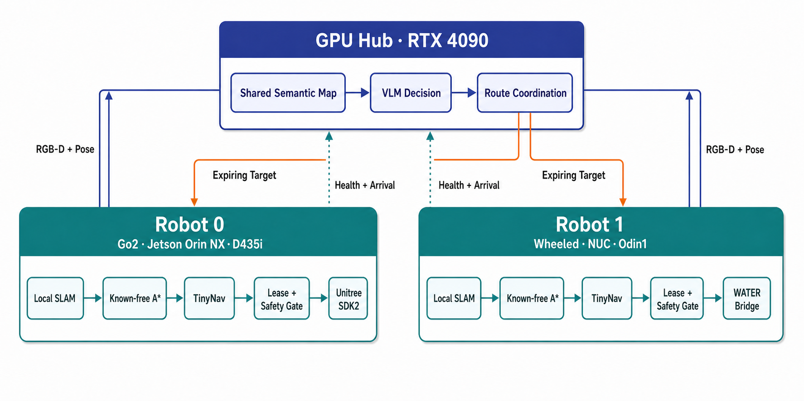

# Robot 0 reproducible deployment baseline

This baseline defines the reproducible Robot 0 path used by the real-world
system: an RTX 4090 Hub performs semantic inference and high-level
coordination, while a Jetson Orin NX mounted on a Unitree Go2 performs
perception, mapping, planning, control, and the final motion-safety checks.

The machine-readable contract is
[`hub/config/deployments/realworld_dual_robot_v1.json`](../hub/config/deployments/realworld_dual_robot_v1.json).
The first acceptance command is read-only:

```bash
python3 hub/tools/verify_public_baseline.py --workspace .
```

It verifies the hardware record, authority split, pinned upstream revisions,
and the size/SHA-256 of every control-path source file. It does not import ROS,
open a robot connection, or publish a command.

## Reference hardware

| Role | Reference compute | Platform and sensor | Runtime responsibility |
| --- | --- | --- | --- |
| Hub | Intel Core i9-14900K, 64 GB RAM, NVIDIA GeForce RTX 4090, Ubuntu 22.04.5 | Central workstation | RedNet/Detectron2 semantics, shared-map fusion, CogVLM2 decisions, route coordination |
| Robot 0 | NVIDIA Jetson Orin NX, JetPack 6.2.1/L4T 36.4.7, Ubuntu 22.04.5 | Unitree Go2 + Intel RealSense D435i | TinyNav perception/SLAM, online occupancy, route and local planning, controller, guarded Unitree SDK2 bridge |
| Robot 1 | ASUS NUC 12 Pro NUC12WSK-B, Core i7-1260P, 16 GB RAM, Ubuntu 22.04.5 | Wheeled chassis + Manifold Tech Odin1 | Odin localization, online occupancy, the same TinyNav planning/controller contract, guarded WATER bridge |

The values above are observed deployment values, not minimum requirements.
Their read-only evidence sources are recorded in
[`audit/DEPLOYMENT_HARDWARE_20260730.json`](../audit/DEPLOYMENT_HARDWARE_20260730.json).
For a different Jetson, camera, firmware, or mount, create a new manifest and
repeat the static, hardware, observation, and calibration gates.

Vendor references:

- [NVIDIA Jetson Orin](https://www.nvidia.com/en-us/autonomous-machines/embedded-systems/jetson-orin/)
- [Unitree SDK2 Python](https://github.com/unitreerobotics/unitree_sdk2_python)
- [Intel RealSense D400 series](https://realsenseai.com/wp-content/uploads/2024/10/Intel-RealSense-D400-Series-Datasheet-October-2024.pdf)
- [ASUS NUC 12 Pro support](https://www.asus.com/supportonly/nuc12wsb/helpdesk_manual/)

## Authority and data flow

<p align="center">
  
</p>

The Hub never owns wheel, leg, or body velocity. Each target carries a lease;
the robot may reject it, HOLD, or stop. Expired authority, stale odometry,
stale occupancy, stale trajectories, invalid calibration, unreachable goals,
or an unacknowledged pause all close the guarded output to zero.

Robot-to-Hub traffic uses an authenticated loopback endpoint through an SSH
tunnel. The deployment does not expose the Hub API on a robot LAN, and tokens
are never stored in tracked configuration.

## Planner and controller

The physical navigation stack has four explicit stages.

| Stage | Deployed logic |
| --- | --- |
| High-level decision | The Hub maintains one shared A–D candidate set, runs the Perception–Judgment–Decision cascade, applies cross-robot route coordination, and publishes expiring high-level targets only. |
| Route planner | A bounded, 8-connected A* search runs on the latest robot-local known-free occupancy grid. Unknown and occupied cells are blocked, diagonal corner cutting is forbidden, and the route is replanned every 0.5 s with a 20,000-expansion/0.5 s bound. A frontier leg may make safe partial progress toward the known-map edge. |
| TinyNav local planner | A rolling route waypoint enters TinyNav's trajectory lattice. The complete candidate is scored against the ESDF with the platform footprint. Forward arcs and in-place yaw remain available; fixed reverse and exact stationary candidates are excluded. Collision-scored stopped prefixes at 0.5, 1.0, and 2.0 s preserve short safe advances. If every candidate collides, the output is STOP. |
| TinyNav controller and gate | The pinned TinyNav path follower uses the measured base-to-camera transform, stable rotate-first handling, and a 0.18 m/s linear engagement floor. A stale pose after 0.8 s, stale path after 1.0 s, meaningful reverse segment, arrival, or pose jump closes raw velocity. The v2 receiver then applies lease, map, localization, trajectory, reachability, and pause-acknowledgement checks before publishing guarded velocity. |

Robot-specific geometry remains local:

- Robot 0 retains TinyNav's Go2 rectangular footprint. Its route lookahead is
  1.0 m, route clearance is 0.05 m, and the bounded start seed uses a 0.35 m
  footprint override within 0.75 m.
- Robot 1 uses a measured 0.283 m circular body radius plus 0.05 m planner
  margin. Its route lookahead is 0.35 m, route clearance is 0.30 m, and the
  bounded start seed uses a 0.34 m override within 1.0 m.

The Robot 0 actuator bridge subscribes only to
`/focus_guarded_cmd_vel`, caps velocity at 0.20 m/s forward, 0.00 m/s lateral,
and 0.50 rad/s yaw, and independently stops after 0.35 s without a command.
It calls Unitree SDK2 `SportClient.Move`; it never subscribes directly to raw
`/cmd_vel`.

## Locked software bill

| Component | Locked baseline |
| --- | --- |
| TinyNav | `UniflexAI/tinynav@576c082e69580f618a5ff313a3e74f3672abb69f` |
| Reconstructed Robot 0 tree | commit `a6290559b13cedf19c05f7ec64ff91a29b685cbd`, tree `5281e70451f2f9cc1d5f5464315d803f6f0972bd` |
| Unitree SDK2 Python | BSD-3-Clause; resolved revision `800103eab7e045336b1c40186cda5023dbd05821` |
| ROS | ROS 2 Humble |
| RealSense | librealsense 2.58.1, realsense-ros 4.58.1, D435i firmware 5.17.0.10 |
| Hub semantic runtime | Python 3.10.20, PyTorch 2.8.0+cu128, torchvision 0.23.0, Detectron2 0.6 |

`bootstrap_go2.sh` reconstructs the Robot 0 TinyNav tree from the Apache-2.0
upstream base plus two checksummed patches:

1. the Robot 0 deployment, Go2 bridge, and IMU recovery state;
2. the formal 0.35 s bridge-watchdog runtime contract.

The optional experimental semantic archive is not required by the formal
native BuildMap path.

## Clean-room installation

Use the same committed Git revision on the Hub and Robot 0. Both installers
print a complete plan by default; only `--apply` changes the host. Neither
installer starts ROS, the Hub, a planner, a receiver, or an actuator.

### RTX 4090 Hub

Start with Ubuntu 22.04, an RTX 4090, and a working NVIDIA driver:

```bash
git clone https://github.com/AlanZhu2006/topofocus_realworld.git
cd topofocus_realworld

bash hub/scripts/bootstrap_gpu_hub_cleanroom.sh
bash hub/scripts/bootstrap_gpu_hub_cleanroom.sh \
  --apply \
  --fetch-models \
  --accept-model-licenses
```

`--fetch-models` obtains only the pinned real-world checkpoints after explicit
license acknowledgement. It never downloads HM3D scenes, ObjectNav data,
overlays, SIF images, bags, or maps. If the models were provisioned separately,
omit both model flags; the same full checksum gate still runs.

The resulting runtime is Python 3.10.20, PyTorch 2.8.0+cu128, torchvision
0.23.0+cu128, CUDA 12.8, and Detectron2 0.6. All Python wheels are resolved by
[`hub/gpu_runtime/uv.lock`](../hub/gpu_runtime/uv.lock). Full model and host
provenance is written under
`${XDG_STATE_HOME:-$HOME/.local/state}/topofocus/`.

### Jetson Orin NX on Unitree Go2

Flash the recorded JetPack 6.2.1/L4T 36.4.7 image first, connect the D435i and
dedicated Go2 Ethernet link, then clone the same repository revision:

```bash
git clone https://github.com/AlanZhu2006/topofocus_realworld.git
cd topofocus_realworld

bash hub/robot_overlay/bootstrap_robot0_cleanroom.sh
bash hub/robot_overlay/bootstrap_robot0_cleanroom.sh --apply
```

The apply path installs ROS 2 Humble, builds the pinned CycloneDDS, GTSAM,
librealsense, realsense-ros and message-filter sources, deterministically
reconstructs TinyNav, verifies all five ONNX files, builds the four runtime
TensorRT plans, installs the USB stability policy, and writes:

```text
${XDG_DATA_HOME:-$HOME/.local/share}/topofocus/robot-0/
${XDG_CONFIG_HOME:-$HOME/.config}/topofocus/robot-0.env
${XDG_CONFIG_HOME:-$HOME/.config}/topofocus/robot-0-setup.bash
${XDG_STATE_HOME:-$HOME/.local/state}/topofocus/
```

No username or repository checkout path is compiled into those files.
`/tinynav` is a compatibility symlink because the pinned upstream TinyNav
runtime contains model paths rooted there.

Review and apply the transient host-side Go2 LAN configuration:

```bash
bash hub/robot_overlay/configure_go2_network.sh
bash hub/robot_overlay/configure_go2_network.sh --apply
```

The network tool validates the CIDR and route but does not ping Go2 or create a
DDS participant. For a non-`eth0` installation, pass `--interface`,
`--host-cidr`, and `--robot-address`, then place the same values in the
generated untracked `robot-0.env`.

Store the matching robot API token separately:

```bash
config_root="${XDG_CONFIG_HOME:-$HOME/.config}/topofocus"
install -d -m 0700 "$config_root"
install -m 0600 /dev/null "$config_root/robot-0.token"
# Write the provisioned token interactively; never commit it.
```

With all command/planning processes stopped, run the read-only hardware gate:

```bash
config_root="${XDG_CONFIG_HOME:-$HOME/.config}/topofocus"
set -a
source "$config_root/robot-0.env"
set +a
source "$TINYNAV_SETUP"
"$TINYNAV_PYTHON" hub/robot_overlay/verify_robot0_cleanroom.py \
  --level hardware
```

This checks the exact source/tree identities, Python imports, TensorRT plans,
JetPack/L4T/ROS versions, D435i USB identity and firmware, USB power policy,
`usbfs_memory_mb`, and the host route to Go2. It initializes neither Unitree
DDS nor any motion process.

## Observation and native mapping

After the hardware gate passes, the following observation path still cannot
move the robot:

```bash
config_root="${XDG_CONFIG_HOME:-$HOME/.config}/topofocus"
bash hub/robot_overlay/start_go2_observation.sh \
  --env "$config_root/robot-0.env"

map_root="${XDG_DATA_HOME:-$HOME/.local/share}/topofocus/maps"
bash hub/robot_overlay/start_go2_buildmap.sh \
  --env "$config_root/robot-0.env" \
  --output "$map_root/robot0-baseline"
bash hub/robot_overlay/save_go2_buildmap.sh \
  --env "$config_root/robot-0.env"
```

The observation launcher starts only D435i and TinyNav perception. Native
BuildMap is accepted only after `/benchmark/data_saved=true` and a clean mapper
exit.

## Calibration and supervised execution

Give the Hub two existing SSH/tmux shells, the absolute remote release roots,
the camera-to-base calibration files, and loopback-only SSH tunnel endpoints.
Runtime tokens, maps, calibration artifacts, and the resulting session remain
outside Git. The session binds their paths, byte sizes, SHA-256 values, the
exact code commit, transforms, maps, ports, and robot policies.

Create a fresh board calibration and strict no-motion debug using
[`hub/docs/ONECLICK_SESSION_WORKFLOW.md`](../hub/docs/ONECLICK_SESSION_WORKFLOW.md).
That guide provides the exact SSH reverse tunnels and required
`FOCUS_ROBOT0_*` / `FOCUS_ROBOT1_*` runtime variables.
After that same session and commit pass debug, supervised physical execution
is a separate command:

```bash
bash hub/scripts/realworld_oneclick.sh \
  --session-file current \
  --mode live \
  --scene-id reproduce-live \
  --episode-id reproduce-live-01 \
  --goal-category plant \
  --operator-confirmation OPERATOR_PRESENT_AND_ROBOTS_CLEAR
```

The per-run confirmation is deliberately absent from every config file. The
Hub emits only versioned, expiring high-level targets; Robot 0 retains the
final right to reject, HOLD, or stop, and its bridge independently stops after
0.35 seconds without a guarded command.

## Reproduction levels

| Level | Evidence | Motion possible |
| --- | --- | --- |
| R0 | Public manifest and byte contracts pass | No |
| R1 | Clean TinyNav reconstruction yields the expected commit/tree | No |
| R2 | Jetson hardware/USB/IMU preflight passes | No |
| R3 | Observation and native map save complete | No autonomous motion |
| R4 | Fresh calibration and full debug command graph pass | No |
| R5 | Explicitly authorized live episode with terminal archive | Yes, operator-supervised |

Report the highest completed level instead of treating a code-only
reconstruction as a physical replication.

## Publication and artifact boundary

The reproducible deployment implementation lives under `hub/`. Model weights,
datasets, firmware, bags, runtime tokens, and maps are intentionally external
and are checked through manifests rather than committed.

The root repository does not yet declare a project-wide license.
`source/Focus_realworld` has no project-wide license in its snapshot, and the
redistribution terms for `dependencies/RedNet` remain unverified. Public
release therefore requires an owner-selected root license and a completed
third-party redistribution review; this deployment baseline does not invent
those rights. See [`THIRD_PARTY_NOTICES.md`](../THIRD_PARTY_NOTICES.md).
