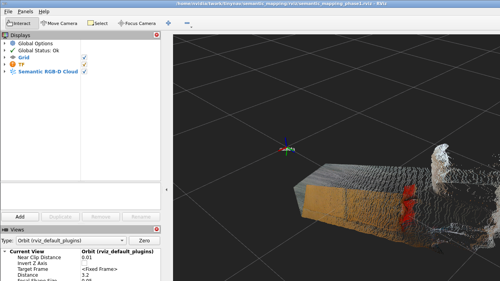
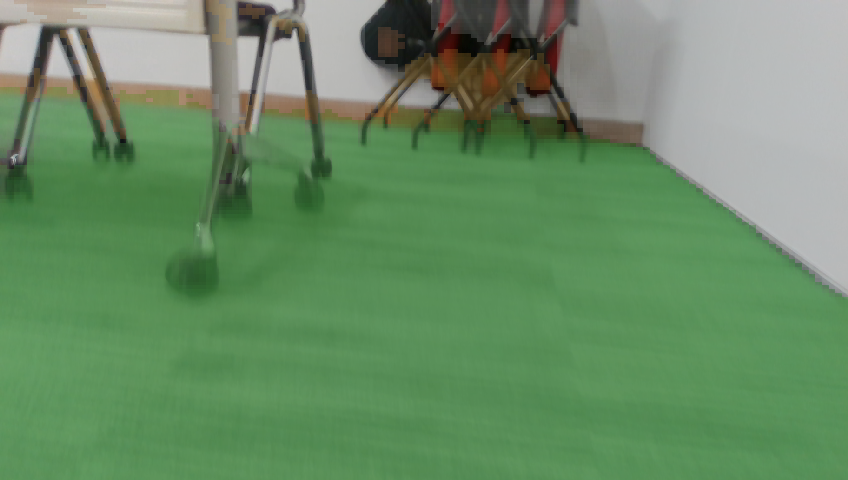
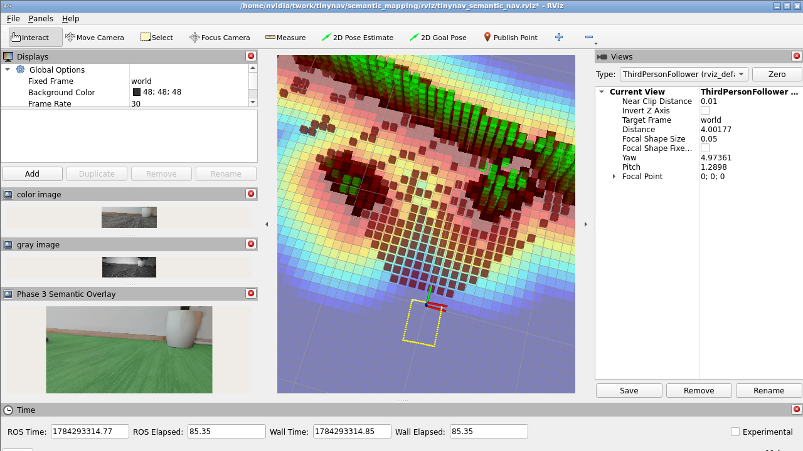
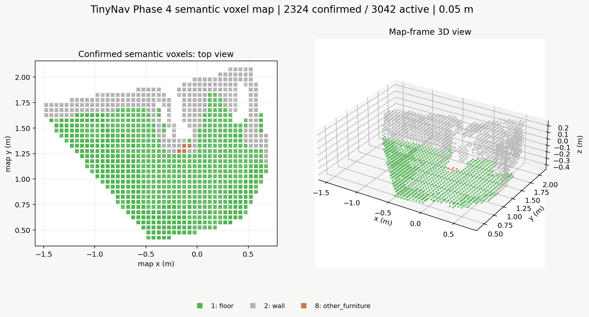
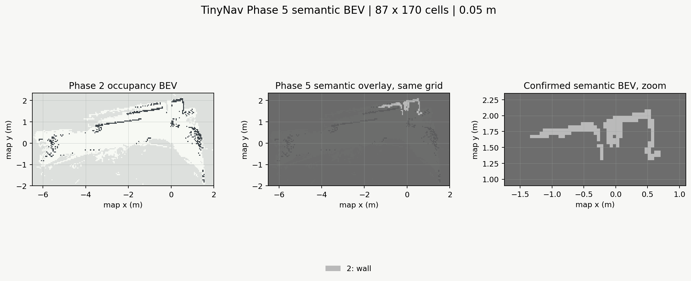

# Semantic Mapping Phase-1 Through Phase-5 Results

Status date: 2026-07-17

## Completed

- Audited the RealSense, TinyNav perception, map, planning, and Go2 launch
  paths.
- Located and characterized a repeatable 119-second local sensor bag.
- Confirmed sensor encodings, calibration, frames, timestamps, and current
  alignment limitations from serialized messages.
- Defined the map/RGB transform composition and documented the disconnected
  TinyNav camera alias.
- Added a pure, testable depth backprojection implementation and a separate ROS
  point-cloud wrapper in the `semantic_mapping` package.
- Added alignment-aware RealSense/recording configuration for future bags.
- Added isolated semantic copies of auto-map and auto-nav; the original scripts
  are unchanged.
- Documented the sparse semantic voxel and height-aware BEV implementation
  plan.
- Built the package and passed all 70 geometry, raycasting, ground, BEV,
  persistence, pose, message-layout, schema, backend, and visualization tests.
- Verified live aligned RGB-D backprojection and deterministic posed-bag replay.
- Verified map-frame composition with a known synthetic TF: 100,893 matched
  points had the expected `[-1,-2,0]` meter offset with `1.2e-7` meter maximum
  error.
- Added sparse log-odds occupancy voxels, vectorized 3D DDA free-space carving,
  keyframe/pose-jump gating, height-aware occupancy BEV, and geometry map
  serialization without adding a semantic model.
- Replayed the posed RGB-D bag end to end and loaded the saved Phase-2 map back
  successfully.
- Added relocalization readiness gating, filtered local ground-plane estimation,
  30-second checkpoints, an explicit save service, and checkpointed shutdown.
- Verified genuine TinyNav relocalization against the newly built map and live
  map-frame voxel/BEV publication without enabling the Go2 bridge.
- Vectorized the height-aware BEV reducer; a live 136k-voxel projection fell
  from about 3.5 seconds to 0.15-0.20 seconds on the Jetson.
- Added a versioned closed-set class schema, backend-neutral `SemanticFrame`,
  deterministic timestamp-matched precomputed mask backend, and a separate ROS
  semantic perception node.
- Published and ROS-smoke-tested RGB-stamped `mono8` labels, `32FC1`
  confidence, `rgb8` overlay, and transient-local class metadata.
- Added a TensorRT SegFormer-B0 ADE20K backend, a pinned/checksummed model
  preparation script, deterministic rosbag mask generation, and the validated
  ADE20K-to-navigation class mapping.
- Added separate sparse Phase-4 semantic voxels with confidence, range, and
  mask-edge weighting; unknown/dynamic rejection; multi-observation
  confirmation; save/load; RViz markers; and a checkpoint service.
- Added a Phase-5 height-aware semantic BEV that is grid-aligned with Phase-2
  occupancy, publishes class/confidence/height/exploration channels, and saves
  an `H x W x C` planner tensor without overwriting geometry occupancy.

## Point-Cloud Output

Phase 1 publishes:

```text
/semantic_mapping/semantic_pointcloud
```

The cloud contains RGB-packed XYZ points in the configured target frame. The
default online target is `map`; offline initial-map validation uses `world`.
Frames are dropped on synchronization, alignment, or TF failure rather than
being transformed with a latest camera pose.

Live verification produced roughly 100.8k points per cloud at about 3.1 Hz.
The tested Jetson required a 2.0-second image buffer because TinyNav publishes
correctly stamped poses after inference latency.

## Phase-2 Occupancy Output

The occupancy mapper synchronizes the point cloud with the exact camera pose
used to create it, uniformly caps each accepted keyframe at 6,000 rays, and
publishes:

```text
/semantic_mapping/occupied_voxels
/semantic_mapping/occupancy_bev
/semantic_mapping/occupancy_probability_bev
/semantic_mapping/free_probability_bev
/semantic_mapping/explored_bev
/semantic_mapping/height_max_bev
/semantic_mapping/map_metadata
```

The 5.67-second offline validation bag produced:

```text
frame:              world
voxel resolution:   0.05 m
active voxels:      5,942
free voxels:        4,311
occupied voxels:    1,404
uncertain voxels:     227
BEV shape:          39 x 45
BEV origin:         [-1.45, -0.05] m
```

Saved output includes `metadata.yaml`, `voxels.npz`, separate BEV NPY arrays,
and `planner_tensor.npz`. Save/load round-trip validation preserved every voxel
index, log-odds value, observation count, and timestamp.

## Phase-2.5 Live Validation

The copied navigation chain was started with `--no-go2` against
`output/semantic_map_record_20260717_102052`. TinyNav produced repeated genuine
relocalization poses and the semantic mapper integrated in `map`. A clean
checkpoint contained roughly 140k active voxels in a 94x141 BEV. Exact counts
continue to change while the live mapper is running.

The local ground fit observed 700-1,000 inliers from 4,000 near-ground
candidates in the tested cluttered view. A historical map began at
`ground_z=0.0 m` even though its floor was lower. The mapper now first collects
three consistent broad-band, camera-below planes, locks the observed ground
height, and then returns to the narrow-band median/EMA tracker. This operates
from TinyNav's timestamped map-to-camera pose; a body-to-camera measurement is
for independent collision-envelope validation, not basic RGB-D mapping.

Restart testing verified that the mapper loads the matching nested occupancy
map before new integration. When the restarted view had fewer than TinyNav's
50 required feature matches, the map-alignment gate published the loaded map
but integrated zero new frames until relocalization succeeds.

## Phase-3 Perception Validation

A synthetic 3x4 RGB frame at timestamp `1234567890 ns` was matched against a
version-1 NPY manifest through the real ROS node. The observed products were:

```text
semantic_label_image:      mono8,  3x4, exact RGB header
semantic_confidence_image: 32FC1, 3x4, exact RGB header
semantic_visualization:    rgb8,   3x4, exact RGB header
semantic_class_metadata:   reliable + transient-local JSON
processed:                 4
unavailable / invalid:     0 / 0
cached processing time:    about 3.2 ms/frame in this small smoke test
```

Clean SIGINT shutdown was also verified after correcting double context
shutdown handling. This test validates message plumbing and timestamp policy,
not segmentation accuracy on the recorded room.

The real 65.29-second mapping bag was then processed at 2 Hz:

```text
RGB dimensions:          480 x 848
source RGB messages:     1,912
semantic frames:         131
output size:             207 MB
wall time:               48.8 s
mean processing:         97.2 ms/frame
TensorRT engine:         10.1 MB FP16
engine-only GPU latency: 11.5 ms mean during trtexec benchmark
```

The final masks contain floor, wall, door, chair, table, cabinet,
other_furniture, and dynamic_object. No couch was present/confirmed in this
recording. Isolated ROS TensorRT replay processed about 2.16 FPS while the
existing TinyNav stack remained active, with exact RGB headers and zero
invalid/unavailable frames. The full result is available through
`output/latest_semantic_masks`.

The backend was also attached to the already-running copied `--no-go2` session
without restarting TinyNav. Live RGB arrived at about 22-23 Hz and the
rate-limited semantic output held about 4.7 FPS with roughly 136 ms mean
callback time after warmup, zero unavailable frames, and zero invalid frames.
RViz subscribed to the
overlay after its Phase-3 configuration was reloaded. This camera-frame result
does not bypass the independent map-alignment gate, which remains closed while
TinyNav cannot relocalize at the robot's current position.

## Phase-4 Semantic Voxel Validation

The ROS smoke test injected floor, wall, dynamic, and unknown observations into
an isolated `semantic_mapper_node`. It published two confirmed static voxels,
skipped dynamic/unknown observations, saved through
`/semantic_mapping/save_semantic_map`, and loaded the saved data back with the
same labels.

The copied auto-map chain then rebuilt a TinyNav map and ran Phase 2 geometry
plus Phase 4 fusion against the complete 65.29-second aligned RGB-D bag and
the deterministic Phase-3 mask manifest:

```text
map directory:         output/phase4_validation_map_20260717
semantic voxel size:   0.05 m
input point sets:      17
accepted keyframes:     5
active semantic voxels: 3,042
confirmed voxels:       2,324
floor:                  1,045
wall:                   1,273
other_furniture:            6
mean fusion time:      179.06 ms / accepted keyframe
semantic map size:      24,052 bytes
```

The saved metadata uses frame `world`, carries the full class schema, and the
semantic result is independently loadable from `semantic_metadata.yaml` and
`semantic_voxels.npz`. During the latter part of this specific TinyNav offline
rebuild, the pose stream had nine translation/yaw jump events. The mapper
recorded them and kept the semantic map at five accepted keyframes rather than
integrating a shifted pose. That is intentional data protection, not a dropped
diagnostic.

The copied `tinynav_semantic_auto_nav.sh` was also started with `--no-go2` and
the saved map. It loaded 115,776 geometry voxels and all 3,042 semantic voxels
under its explicit `world -> map` restore override, then transient-local
publication returned a semantic voxel cloud width of 2,324. At the current
physical location TinyNav reported zero relocalization similarity matches, so
the map-alignment gate correctly integrated no new live RGB-D observations. The
saved map remained published. The copied shutdown script now waits briefly for
ROS service discovery, then successfully checkpoints both geometry and semantic
layers.

## Phase-5 Semantic BEV Validation

The Phase-5 projector aggregates only confirmed static semantic voxel evidence.
Normal classes use the configured semantic band; ground-band floor is a fallback
only, so it cannot replace an object in the same XY cell. Artificial voxel tests
cover floor, object-over-floor, overhead rejection, unknown cells, and explicit
occupancy-grid alignment.

The saved real map was loaded through the actual ROS mapper and published:

```text
occupancy / semantic grid: 87 x 170 cells
resolution:                0.05 m
origin:                    [-6.5, -2.0] m
semantic score tensor:     87 x 170 x 11 float32
semantic BEV encoding:     mono8
semantic BEV view:         rgb8
confirmed semantic cells:  151 wall cells
```

The copied `--no-go2 --no-rviz` auto-nav chain then loaded the same map,
published the same `170 x 87` semantic BEV, and checkpointed both map layers.
TinyNav did not relocalize at the current physical location, so no live frame
was added to either map. The saved semantic output now includes
`semantic_bev.npy`, confidence/explored/height NPY channels, and
`semantic_bev_tensor.npz` with `semantic_scores[H,W,C]`.

This historical recording predates startup ground bootstrap: confirmed floor
voxels are around `z=-0.4 m`, while its saved Phase-2 `ground_z` is `0.0 m`.
The new bootstrap detects a stable `-0.525 m` local floor plane from the saved
geometry diagnostic before normal BEV projection. The recording should be
replayed to regenerate a planner tensor with that observed reference before
using floor semantics for collision-certified navigation.

## Reproduction

Build the ROS package from a workspace containing this repository:

```bash
source /home/nvidia/twork/tinynav_setup.bash
colcon build --packages-select semantic_mapping --symlink-install
source install/setup.bash
```

Run the isolated live geometry/occupancy chain directly:

```bash
# Shell 1
bash scripts/run_realsense_semantic_sensor.sh

# Shell 2
uv run python /tinynav/tinynav/core/perception_node.py

# Shell 3
bash scripts/run_semantic_pointcloud.sh --online --target-frame world
```

After TinyNav relocalizes in a saved-map area, use:

```bash
bash scripts/run_semantic_pointcloud.sh --online --target-frame map
```

To resume the occupancy map produced by the matching copied auto-map run:

```bash
bash scripts/run_semantic_pointcloud.sh --online --target-frame map \
  --input-dir output/latest_semantic_map/semantic_mapping \
  --allow-frame-override
```

The override is explicit because offline construction records the future map
coordinates under their original `world` frame name. Do not use it with an
occupancy directory from a different TinyNav map.

Replay a minimal posed bag without RealSense or perception:

```bash
# Shell 1
ros2 launch semantic_mapping semantic_mapping_offline.launch.py \
  target_frame:=world \
  output_directory:=/tmp/phase2_map

# Shell 2
ros2 bag play <bag_path> --clock
```

Validate a newly recorded semantic bag before replay:

```bash
python3 tool/validate_tinynav_bag.py --bag <bag_path> \
  --require-semantic-inputs
```

Minimal posed-bag capture and validation, with perception already running:

```bash
bash scripts/run_semantic_rosbag_record.sh --minimal --output <bag_path>
python3 tool/validate_tinynav_bag.py --bag <bag_path> --semantic-only
```

Integrated copied entry points:

```bash
bash scripts/tinynav_semantic_auto_map.sh
bash scripts/tinynav_semantic_auto_nav.sh --no-go2
bash scripts/stop_tinynav_semantic_nav.sh
```

Prepare the pinned model and generate deterministic masks:

```bash
bash scripts/prepare_segformer_trt.sh
python3 scripts/precompute_semantic_masks.py \
  --bag <bag_path> \
  --output-dir <mask_directory> \
  --rate-hz 2
```

Run live TensorRT perception through the copied chain:

```bash
bash scripts/tinynav_semantic_auto_nav.sh --no-go2 \
  --semantic-tensorrt \
  "$HOME/.cache/tinynav/semantic_models/segformer_b0_ade20k/model_fp16.engine"
```

Enable Phase-3 precomputed perception during deterministic bag replay:

```bash
bash scripts/tinynav_semantic_auto_map.sh \
  --from-bag <bag_path> \
  --semantic-masks <precomputed_mask_directory>
```

The directory must contain `manifest.yaml` plus its referenced `.npy` files.
An alternate manifest or class schema can be selected with
`--semantic-manifest` and `--semantic-classes`. The same optional flags are
available on the copied auto-nav script, but a live run only produces labels
when its RGB timestamps exist in that manifest.

The Phase-4 output is saved automatically by the copied auto-map script. It
can be reloaded by the copied auto-nav chain when it is nested below the
selected TinyNav map:

```bash
bash scripts/tinynav_semantic_auto_nav.sh \
  --map output/latest_semantic_map \
  --no-go2 \
  --semantic-masks output/latest_semantic_masks
```

RViz validation:

1. Set Fixed Frame to `map` online or `world` during initial offline mapping.
2. Add a PointCloud2 display for
   `/semantic_mapping/semantic_pointcloud`.
3. Set color transformer to RGB.
4. Add `/semantic_mapping/occupied_voxels` with channel `occupancy`.
5. Add `/semantic_mapping/occupancy_bev` as a Map display.
6. Add `/semantic_mapping/semantic_voxels` as a PointCloud2 display, or add
   `/semantic_mapping/semantic_voxel_markers` as a MarkerArray display.
7. Check a floor and a vertical wall while moving the camera.
8. Online, overlay `/mapping/static_occupancy_grid` after relocalization.

## Current Visualization Result

Live D435i + TinyNav perception + RViz validation succeeded in the mapping
session `world` frame:



The scene is metric and RGB colored, and includes planar furniture/surfaces at
the expected depth.

The real Phase-3 overlay shows floor in green, walls in gray, chairs in yellow,
tables in brown, and unrecognized pixels unmodified:



The current VNC session also shows live RGB, infrared, loaded occupancy, and the
TensorRT overlay together:



The Phase-4 result below is rendered directly from the saved semantic voxel
NPZ. It is a map-frame product, not a perspective-warped segmentation image:



The Phase-5 result below overlays the saved semantic BEV on the independent
occupancy grid and then zooms the confirmed semantic cells:



The newer full-bag ground-bootstrap replay records `ground_z=-0.380 m` and
produces an aligned `169 x 155` semantic tensor with 682 floor cells, 261 wall
cells, and three other-furniture cells. It is the current planner-ready Phase-5
artifact; the earlier image remains a visual record of the pre-bootstrap map.

Phase-2 offline publication and serialization are validated in `world` using
the posed bag. Live saved-map overlay is now also validated against a genuine
TinyNav relocalization. After any later restart, a changed or feature-poor view
may require a small camera motion before TinyNav again exceeds its match
threshold; the semantic integration gate remains closed meanwhile.
